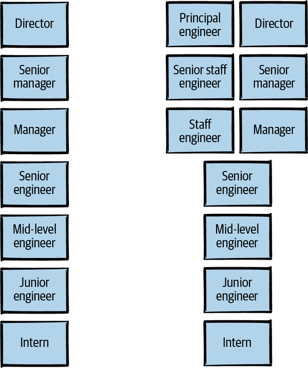
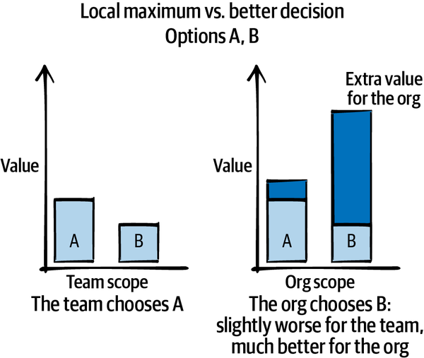

# 你会说你在这里做什么？

主管工程师轨道或"技术轨道"的想法对很多公司来说都是新的。 组织对他们对最高级工程师的期望以及这些工程师应该从事什么样的工作的期望各不相同。 尽管大多数人都同意，正如 Silvia Botros 所写，技术轨道的顶端不仅仅是"更资深的前辈"，但我们对它是什么没有达成共识。 因此，我们将从存在主义开始本章：为什么一个组织需要非常资深的工程师留下来？ 然后，带着这种理解，我们将解开这个角色：它的技术要求、它的领导力要求，以及自主工作的意义。
主管工程角色有多种形式。 有许多有效的方法可以完成这项工作。 但有些形状会更适合某些情况，并不是所有组织都需要各种各样的工程师。 因此，我将讨论如何表征和描述主管工程角色：它的范围、深度、报告结构、主要关注点和其他属性。 你可以使用这些描述来准确说明你希望如何工作、你希望成长为什么样的角色或你需要雇用谁。 最后，由于不同的公司对主管工程师应该做什么有不同的想法，我们将努力使你的理解与你组织中其他关键人员的理解保持一致。
让我们从这份工作开始吧。

## 什么是主管工程师？

如果唯一的职业道路是成为一名经理（如图 1-1 左侧所示的公司），许多工程师将面临一个严峻而艰难的选择：继续担任工程师角色并继续提高他们的技能或 转向管理并在他们的职业生涯中成长。
因此，许多公司现在提供"技术"或"个人贡献者"轨道是件好事，允许职业发展与经理角色并行。 图 1-1 右侧的梯形图显示了一个示例。

图 1-1。 两个示例职业阶梯，一个有多条路径。
职位阶梯因公司而异，足以催生一个网站 [levels.fyi](levels.fyi)，比较各公司的技术阶梯。^1^ 这些阶梯上的梯级数量各不相同，每个梯级的名称也是如此。 你甚至可能会以不同的顺序看到相同的名字。^2^ 但是，通常会使用 senior 这个词。 曾在两家公司创建职业阶梯的工程总监马可罗杰斯 (Marco Rogers) 将高层描述为职业阶梯的"锚定"级别。 正如罗杰斯所说，"下面的层次是为了人们增强自主权； 上述级别增加了影响和责任。"
高级有时被视为"终身"级别：你不需要更进一步。^3^ 但如果你这样做，你就进入了"技术领导"级别。 高级工程师之上的第一个梯级通常被称为"高级工程师"，这就是我将在整本书中使用的名称。
在图 1-1 的双轨工作阶梯中，高级工程师可以选择培养技能以晋升为经理或主管工程师角色。 一旦他们被提拔，角色从工程师到经理的转变，或相反，将被视为横向调动，而不是进一步晋升。 高级工程师与高级经理的资历相同，首席工程师与董事的资历相同，依此类推； 在公司的职业阶梯中，这些水平可能会继续更高。 （为了表示高级以上的所有角色，我将使用 staff+，这是 Will Larson 在他的《Staff Engineer》一书中创造的一种表达方式。）

> **关于标题的注释**
> 我偶尔听到有人坚持认为职位和等级不挂钩（或不重要）。 提出这种说法的人往往会合理地说他们的公司是一个对等级制度的危险保持警惕的平等主义精英制度。 "我们是一种自下而上的文化，所有想法都受到尊重，"他们说，这是一个令人钦佩的目标：在你的职业生涯早期不应该意味着你的想法被驳回。
> 但头衔确实很重要。 Medium 工程团队写了一篇博文，列出了标题必不可少的三个原因："帮助人们了解他们正在进步，将权力授予那些可能不会自动获得它的人，并向外界传达预期的能力水平。"
> 虽然第一个原因是内在的，也许不是每个人的动机，但其他两个描述了头衔对其他人的影响。 无论一家公司是否声称扁平化和平等主义，总会有人对不同级别的人有不同的反应，我们大多数人至少都有一点身份意识。 正如科罗拉多州立大学创业学临床教授 Kipp Krukowski 博士在他 2017 年的论文"员工职称对客户尊重的影响"中所说，"职称是一种象征，公司用它们来表明他们的品质 员工对公司内外的个人。"
> 我们总是对人做出隐含的判断和假设。 除非我们投入大量时间和精力来意识到我们隐含的偏见，否则这些假设很可能会受到刻板印象的影响。 例如，2015 年的一项调查发现，在接受调查的 557 名 STEM 专业女性中，约有一半被误认为是看门人或行政人员。
> 当一名软件工程师与他们不认识的人一起参加会议时，类似的隐性偏见就会发挥作用。 白人和亚裔男性软件工程师通常被认为更资深、更"技术"、更擅长编码，无论他们是昨天毕业还是已经从事这项工作数十年。 女性，尤其是有色人种女性，被认为资历更浅、资历更差。 他们必须在会议上更加努力地工作才能被认为是有能力的。
> 正如那篇 Medium 工程文章所说，职位头衔赋予了可能不会自动获得它的人权力，并传达了他们预期的能力水平。 通过锚定期望，他们可以节省时间和精力，否则他们将不得不一次又一次地证明自己。 这给了他们一周的一些时间。
> 你现在拥有的头衔也会影响你接下来的工作。 像我们行业的许多人一样，我每天都会在 LinkedIn 上收到招聘人员的电子邮件。 在我的生活中，我收到了 3 次冷门招聘电子邮件，邀请我面试一个比我已有的职位更高级的职位。 所有其他人都建议了一个与我已经处于的水平完全相同的角色，或者更初级的角色。

这就是阶梯上的工作。 但是，让我们看看为什么存在技术领导级别。 我在介绍中谈到了技术赛道的三大支柱：大局观、项目执行和升级。 为什么我们需要工程师具备这些技能？ 为什么我们需要全职工程师？

### 为什么我们需要能看到大局的工程师？
任何工程组织都在不断地做出决策：选择技术、决定构建什么、投资系统或弃用它。 其中一些决定拥有明确的所有者和可预测的后果。 其他是基础架构选择，将影响所有其他系统，没有人可以声称确切知道它们将如何发挥作用。
好的决定需要背景。 经验丰富的工程师知道，大多数技术选择的答案是"视情况而定"。 了解特定技术的优缺点是不够的——你还需要了解当地的细节。 你想做什么？ 你有多少时间、金钱和耐心？ 你的风险承受能力是多少？ 企业需要什么？ 这就是决策的背景。
收集上下文需要时间和精力。 个别团队倾向于为自己的利益进行优化； 单个团队的工程师可能会专注于实现该团队的目标。 但是，看似属于一个团队的决策往往会产生远远超出该团队边界的后果。 局部最大值是单个组的最佳决策，但从更广的角度来看可能就不是最佳决策了。
图 1-2 显示了一个示例，其中团队在两个软件 A 和 B 之间进行选择。两者都具有必要的功能，但 A 的设置要容易得多：它可以正常工作。 B 有点困难：需要几个冲刺的争论才能让它工作，而且没有人热衷于等待那么久。
从团队的角度来看，A 是明显的赢家。 为什么他们会选择其他东西？ 但其他团队更愿意选择 B。事实证明，A 将继续为法律和安全团队工作，其身份验证需求意味着 IT 和平台团队将不得不永远将其视为特例。 通过选择局部最大值 A，团队在不知不觉中选择了一个解决方案，这对整个公司来说是一个更大的时间投资。 B 对团队来说只是稍微差一点，但总体上要好得多。 那些额外的两次冲刺将在四分之一内收回成本，但只有当团队中有人能够看得更广时，这个事实才会显而易见。

图 1-2。 局部最大值与更好的决策。
为了避免局部最大化，团队需要决策者（或至少是决策影响者）能够从局外人的角度出发——他们可以同时考虑多个团队的目标并选择最适合整个组织或整个业务的路径。 第 2 章将介绍缩小和查看更大的愿景。
与了解当前情况的全局一样重要的是能够预测你的决定在未来将如何发挥作用。 一年后，你会后悔什么？ 三年后，你希望自己现在开始做什么？ 为了朝着同一个方向前进，团队需要就技术战略达成一致：投资哪些技术，在哪些平台上进行标准化，等等。 这些重大决定最终可能会变得微妙，而且通常会引起争议，因此做出决定的关键在于能够分享背景信息并帮助他人理解它。 第 3 章是关于作为一个小组选择一个方向的。
所以，如果你想做出广泛的、前瞻性的决定，你需要能看到大局的人。 但为什么不能是经理呢？ 为什么首席技术官 (CTO) 不能只了解所有"业务事物"，将它们转化为技术成果，并传递重要的信息？
在某些团队中，他们可以。 对于一个小团队，经理往往可以充当最有经验的技术专家，拥有重大决策和技术方向。 在小公司，CTO 可以深入参与每个决策的细节。 这些公司可能不需要高级工程师。 但管理层的权威可能会掩盖技术判断：即使有更好的解决方案，报告也可能不愿意与经理的技术决策争论。 管理其他人本身就是一项全职工作。 投资于成为一名优秀的人事经理的人将没有多少时间跟上技术发展的最新动态，而任何设法深入"杂草丛生"的人将无法满足其报告的需求。 在短期内这可能没问题：一些团队不需要太多关注就可以继续走上成功的道路。 但是当团队的需求与技术战略的需求之间存在紧张关系时，经理必须选择关注的重点。 团队成员或技术方向都被忽视了。
这就是许多组织为技术领导力和人员领导力创建不同路径的原因之一。 如果你有多个工程师，那么如果每个决定都需要在 CTO 或高级经理的桌面上结束，那将是低效的——更不用说剥夺权力了。 如果经验丰富的工程师有时间深入研究并建立背景和权威来设定正确的技术方向，你将获得更好的结果和设计。
这并不意味着工程师单独设定技术方向。 管理人员作为负责为技术计划分配人员的人员，需要参与重大技术决策。 我将在本章稍后部分讨论保持工程师和经理之间的一致性，并在第 3 章讨论战略时再次讨论。

> **架构师呢？**
> 在一些公司，"架构师"是职位阶梯技术轨道上的一个梯级。 在其他情况下，架构师是抽象的系统设计师，他们有自己的职业道路，不同于实施系统的工程师。 在本书中，我将把软件设计和架构视为职员+工程师角色的一部分，但请注意，这在我们的行业中并非普遍适用。

### 为什么我们需要领导跨多个团队的项目的工程师？
在理想情况下，组织中的团队应该像拼图一样相互关联，涵盖正在进行的任何项目的所有方面。 然而，在同样的理想世界中，每个人都在从事一个美丽的新绿地项目，没有任何先验限制或遗留系统可以解决，并且每个团队都完全致力于该项目。 团队界限清晰且没有争议。 事实上，我们从 Thoughtworks 技术顾问所称的逆康威策略开始：一组与所需架构的组件完全对应的团队。 这个乌托邦项目的困难部分之所以困难，只是因为它们涉及深入、引人入胜的研究和发明，而它们的所有者渴望解决这些问题的技术挑战和职业荣耀。
我想参与那个项目，你呢？ 不幸的是，现实有些不同。 几乎可以肯定，参与任何跨团队项目的团队在项目构思之前就已经存在，并且正在从事其他事情，甚至可能是他们认为更重要的事情。 他们会在项目中途发现意想不到的依赖关系。 他们的团队边界存在重叠和漏洞，这些漏洞会渗入架构中。 该项目的阴暗和困难部分并不是引人入胜的算法研究问题：它们涉及探索遗留代码，与不想改变任何东西的繁忙团队谈判，以及猜测多年前离开的工程师的意图。^4^ 甚至理解 需要改变的可能是一个复杂的问题，并不是所有的工作都能在一开始就知道。 如果你仔细查看设计文档，你可能会发现它推迟或手挥了最需要调整的关键决策。
这是一个更现实的项目描述。 无论你如何谨慎地将团队叠加到一个巨大的项目上，一些责任最终不会由任何人承担，而其他责任则由两个团队承担。 信息无法流动或在翻译中被破坏并导致冲突。 团队做出出色的局部最大决策，软件项目陷入困境。
保持项目进展的一种方法是让某人对整个项目而不是其中的任何单独部分感到主人翁。 甚至在项目开始之前，该人就可以确定工作范围并制定提案。 一旦项目开始，他们很可能成为高级系统设计的作者或合著者，并且是它的主要联系人。 他们保持高工程标准，利用他们的经验来预测风险并提出尖锐的问题。 他们还花时间非正式地指导或指导项目各个部分的领导者，或者只是为他们树立一个好榜样。 当项目陷入困境时，他们有足够的洞察力来追查原因并解除阻碍（第 6 章对此有更多介绍）。 在项目之外，他们讲述正在发生的事情和原因，向公司其他人推销愿景，并解释这项工作将使什么成为可能以及新项目如何影响每个人。
为什么技术项目经理 (TPM) 不能建立共识和沟通？ 责任肯定有一些重叠。 不过，归根结底，TPM 负责交付，而不是设计，也不是工程质量。 TPM 确保项目按时完成，但员工工程师确保它以高工程标准完成。 高级工程师负责确保生成的系统稳健且适合公司的技术环境。 他们对技术债务持谨慎态度，并警惕任何可能成为这些系统未来维护者的陷阱。 TPM 编写技术设计或为测试或代码审查设定项目标准是不寻常的，而且没有人期望他们深入研究遗留系统的内部结构以决定哪些团队需要与其集成 . 当一名高级工程师和 TPM 在一个大项目上合作得很好时，他们可以成为一个梦之队。

### 为什么我们需要有影响力的工程师？
软件很重要。 我们构建的软件系统会影响人们的福祉和收入：维基百科的软件错误列表值得一读，如果发人深省的话。 我们从飞机失事、救护车系统故障和医疗设备故障中了解到，软件错误和中断可能会导致人员死亡，如果认为未来不会发生更多更大的软件相关悲剧，那就太天真了。 ^5^ 我们需要认真对待软件。
即使赌注较低，我们仍然出于某种原因制作软件。 除了一些类似研发的例外，工程组织通常不会仅仅为了构建更多技术而存在。 他们着手解决实际的业务问题或创造人们想要使用的东西。 他们希望以可接受的质量水平、有效利用资源和尽量减少混乱来实现这一目标。
当然，质量、效率和秩序远未得到保证，尤其是在涉及截止日期的情况下。 当"正确"做事意味着变慢时，急于发布的团队可能会跳过测试、偷工减料或橡皮图章代码审查。 创建好的软件并不容易或直观。 团队需要磨练自己技能的高级人员，他们已经看到成功和失败的原因，并且需要负责创建有效的软件。
我们从每个项目中学习，但我们每个人只有有限数量的经验可以反思。 这意味着我们也需要从彼此的错误和成功中学习。 经验不足的团队成员可能从未见过制作好的软件，或者可能将编写代码视为软件工程中唯一重要的技能。 更多经验丰富的工程师可以通过进行代码和设计审查、提供架构最佳实践以及创建让每个人更快、更安全的工具来产生巨大的影响。
高级工程师是榜样。 经理可能负责在他们的团队中建立文化，强制执行良好的行为，并确保达到标准。 但工程规范是由项目中最受尊敬的工程师的行为设定的。 不管标准怎么说，如果最资深的工程师不编写测试，你就永远无法说服其他人去做。 这些规范超越了技术影响：它们也是文化的。 当资深人士大声赞美他人的工作、相互尊重并提出明确的问题时，其他人也更容易做到这一点。 当处于职业生涯早期的工程师尊重某人是他们希望"长大"成为的那种工程师时，这是一个像他们那样行事的强大动力。 （第 7 章将探讨如何通过成为榜样来提升你的组织。）
也许现在你确信工程师应该做这些大局、大项目、有良好影响的事情，但问题是：他们不能在高级工程师的编码工作量之上做这件事。 在你编写策略、审查项目设计或制定标准的任何时候，你都不是在编码、构建新系统或进行软件工程师可能评估的大量工作。 如果公司最高级的工程师整天只是写代码，代码库会看到他们技能的好处，但公司会错过只有他们才能做的事情。 这种技术领导需要成为做这件事的人的工作描述的一部分。 这不是工作的分心：它就是工作。

## 哲学思考: 我的工作是什么？
员工工程角色的细节会有所不同。 但是，我认为这份工作的某些属性是相当一致的。 我将把它们放在这里，本书的其余部分将把它们视为公理化。

### 你不是经理，但你是领导者

首先，员工工程是领导角色。 高级工程师通常与直线经理具有相同的资历。 首席工程师通常具有董事的资历。 作为一名员工+工程师，你是同级别经理的对应方，你应该和他们一样成为"房间里的成年人"。 你甚至可能会发现自己比组织中的某些经理更资深、更有经验。 每当有一种"应该有人在这里做某事"的感觉时，这个人很可能就是你。
你必须是领导者吗？ 中级工程师有时会问我，他们是否真的需要擅长"那些软弱的人类东西"才能走得更远。 技术能力还不够吗？ 如果你是那种因为想从事技术工作而不喜欢与其他人交谈而进入软件工程领域的人，那么你的职业遇到这堵墙可能会让人感到不公平。 但如果你想继续成长，深入研究技术只能让你走这么远。 完成更大的事情意味着与更多的人一起工作——而这需要更广泛的技能。
随着你的报酬增加，你的时间变得越来越昂贵，你所做的工作预计会更有价值并产生更大的影响。 你的技术判断需要包括业务的实际情况以及任何给定的项目是否值得做。 随着资历的增加，你将承担更大的项目，这些项目如果没有协作、沟通和协调就无法成功； 如果你不能让团队中的其他人相信你的解决方案是正确的，那么你出色的解决方案只会让你感到沮丧。 不管你愿不愿意，你都会成为榜样：其他工程师会向那些拥有重要职位的人学习如何做事。 所以，不：你无法避免成为领导者。
不过，高级工程师的领导方式与经理不同。 高级工程师通常没有直接下属。 虽然他们参与并投资于提高周围工程师的技术技能，但他们不负责管理任何人的绩效或批准休假或费用。 他们不能解雇或晋升——尽管当地团队经理应该重视他们对其他团队成员技能和产出的看法。 它们的影响以其他方式发生。
领导力有多种形式，你可能不会立即认出它们。 它可以来自设计"快乐之路"解决方案，保护其他工程师避免常见错误。 它可以来自以提高他们的信心和技能的方式审查其他工程师的代码和设计，或者来自强调设计方案不满足真正的业务需求。 教学是一种领导形式。 悄悄提高每个人的水平就是领导力。 设定技术方向就是领导力。 最后，作为一流技术专家的声誉可以激励其他人仅仅因为他们信任你而购买你的计划。 如果这听起来像你，那你猜怎么着？ 你是一个领导者。

> **是的，你可以成为一个内向的人。 不，你不能成为一个混蛋。**
> "成为领导者"的想法对很多人来说可能有点吓人。 别担心：并非所有员工和首席工程师都需要成为"人"。 工程人员为内向的人提供了充足的空间——即使是最安静的工程师也可以通过他们的判断和良好的影响力设定一个强有力的技术方向。 你不必喜欢与人相处才能成为一名优秀的领导者。 但是，你确实必须成为榜样，并且必须善待他人。
> 我们中的许多人甚至都有"那个工程师"被拖到角落里的故事，因为他们太难对付了。 1980 年代和 90 年代的技术文化，以 Usenet 等的讨论为例，陶醉于难相处、令人不快的软件工程师的流行形象，他们的同事不仅容忍他们的行为，而且做出奇怪的技术决定只是为了避免与他们打交道。 然而，今天，像这样的工程师是一种负担。 无论他们的产出是多少，都很难想象任何人如何值得其他工程师的产出减少和增长以及当该工程师不会跨团队协作时失败的项目。 选择这些人作为榜样可能会把整个组织搞得一团糟。
> 如果你怀疑你的同事会认为这个侧边栏是关于你的，请查看 Kind Engineering，Squarespace 的 SRE 经理 Evan Smith 就如何成为一个积极友善的同事提供了具体建议。 你会惊讶于你能以多快的速度扭转难以共事的名声。

### 你处于"技术"角色
员工工程是一种领导角色，但它也是一个非常专业的角色。 它需要技术背景以及来自工程经验的各种技能和直觉。 要产生良好的影响，你需要对优秀工程的外观有高标准，并在构建某些东西时对其进行建模。 你对代码或设计的审查应该对你的同事有指导意义，并且应该使你的代码库或架构更好。 当你做出技术决策时，你需要了解权衡取舍并帮助其他人也理解它们。 你需要能够在必要时深入细节，提出正确的问题并理解答案。 当争论特定的行动方案或技术文化的特定变化时，你需要知道你在说什么。 所以你必须有扎实的技术技能基础。
这并不一定意味着你会写很多代码。 在这个级别，你的目标是有效地解决问题，而编程往往不是你时间的最佳利用方式。 对你来说，承担只有你能做的设计或领导工作，让其他人来处理编程可能更有意义。 高级工程师经常处理模棱两可、混乱、困难的问题，并在这些问题上做足够的工作，使它们可以由其他人管理。 一旦问题变得易于处理，它就会成为经验不足的工程师的成长机会（有时需要高级工程师的支持）。
对于一些高级工程师来说，深入研究代码库仍然是解决许多问题的最有效工具。 对于其他人来说，写文档可能会得到更好的结果，或者成为数据分析的高手，或者进行数量惊人的一对一会议。 重要的是问题得到解决，而不是如何解决。 ^6^

### 你的目标是自主

当你刚开始担任工程师时，你的经理可能会告诉你要做什么以及如何处理它。 在高层，也许你的经理建议你解决哪些问题很重要，然后让你自己想办法解决。 在 staff+ 级别，你的经理应该为你提供信息并分享背景信息，但你应该告诉他们什么是重要的，反之亦然。 正如 Intercom 的首席工程师 Sabrina Leandro 所说，"所以你知道你应该从事有影响力和有价值的事情。 但是你在哪里找到你应该做的高影响力工作的神奇积压？" 她的回答是："你创造了它！"
作为组织中的高级人员，你很可能会被拉向多个方向。 捍卫和安排时间取决于你。 一周的时间是有限的（见第 4 章）。 你可以选择如何使用它们。 如果有人要你做某事，你会用你的专业知识来做决定。 你会权衡优先级、时间投入和好处——包括你想与向你求助的人保持的关系——然后你会做出自己的决定。 如果你的 CEO 或其他地方权威人物告诉你他们需要做某事，你会给予适当的重视。 但自治需要责任。 如果他们让你做的事情被证明是有害的，你有责任说出来。 不要默默地让灾难发生。 （当然，如果你想被倾听，你就必须建立起值得信赖和正确的声誉。）

### 你设定技术方向
作为技术领导者，参谋工程师的部分职责是确保组织有一个良好的技术方向。 你的组织提供的产品或服务的基础是一系列技术决策：你的体系结构、你的存储系统、你使用的工具和框架，等等。 无论这些决定是在团队层面做出的，还是跨多个团队或整个组织做出的，你的部分工作就是确保做出这些决定，做出正确的决定，并确保它们被记录下来。 工作不是提出技术方向的所有（甚至不一定是任何！）方面，而是确保有一个商定的、易于理解的解决方案来解决它要解决的问题。

### 你经常和良好的沟通

你的资历越高，你就越依赖强大的沟通技巧。 你所做的几乎所有事情都涉及将信息从你的大脑传递到其他人的大脑，反之亦然。 你越善于被理解，你的工作就会越轻松。

## 了解你的角色

这些公理应该可以帮助你开始定义你的角色，但你会注意到它们遗漏了很多实现细节！ 事实上，一位资深工程师的日常工作可能看起来与另一位工程师的日常工作大不相同。 你的实际角色将取决于你公司或组织的规模和需求，也会受到你个人工作风格和偏好的影响。
这种差异意味着很难将你的工作与你周围或其他公司的高级工程师的工作进行比较。 因此，在本节中，我们将解压角色的一些可变属性。
让我们从报告链开始。

### 你在组织中处于什么位置？

我们的行业尚未确定员工+工程师如何向工程组织的其他部门报告的任何标准模型。 一些公司让他们最高级的工程师向首席架构师或 CTO 办公室报告； 其他人将他们分配给不同组织的主管、不同级别的经理，或者以上所有人员的混合体。 这里没有唯一的正确答案，但可能会有很多错误答案，具体取决于你想要实现的目标。
报告链（参见图 1-3 中的示例）会影响你获得的支持级别、你所了解的信息，并且在许多情况下，还会影响你所在团队以外的同事对你的看法。

图 1-3。 员工+工程师在组织层次结构的不同级别报告。 即使这些工程师的资历都相同，A 也会发现比 D 更容易了解组织背景并进行主管级别的对话。

#### 报告"高"

在组织结构图中报告"高"，例如向董事或副总裁报告，会给你一个广阔的视野。 你获得的信息将是高层次的和有影响力的，你被要求解决的问题也是如此。 如果你要向一位非常称职的高级人员汇报工作，那么看着他们做出决策、召开会议或度过危机可能是一次独特而宝贵的学习经历。
也就是说，如果你有本地经理，你得到经理的时间可能会少很多。 你的经理可能不太了解你的工作，因此可能无法为你提倡或帮助你成长。 与单个团队密切合作但向主管汇报的工程师可能会感到与团队其他成员脱节，或者可能会将主管的注意力拉到本应在团队层面解决的局部分歧上。
如果你发现你的经理不在，没有时间了解你所做的工作，或者被卷入低级的技术决策中，而这些决策并没有很好地利用他们的时间，考虑一下你可能会更快乐 与一位与你的重点更一致的经理。

#### 报告"低"

向组织结构图中较低的经理报告有其自身的优点和缺点。 很有可能你会从你的经理那里得到更多的关注，你也更有可能得到支持。 如果你更喜欢专注于单一技术领域，那么与接近该领域的经理一起工作可能会让你受益。
但是分配给单个团队的工程师可能会发现很难影响整个组织。 不管喜欢与否，人类关注地位和等级制度——以及报告链。 如果你向直线经理汇报，你的影响力可能会小得多。 你获得的信息也更容易被过滤并集中在该特定团队的问题上。 如果你的经理无法访问某些信息，你几乎肯定也不会。
向直线经理报告也可能意味着你要向经验不足的人报告。 这本质上不是问题，但你可以从你的经理那里学到的东西可能更少，而且他们可能对职业发展没有帮助：他们很可能不知道如何帮助你。 如果你在其他地方满足了你的一些管理需求，那么所有这一切都可能没问题。^7^ 特别是，如果你要向组织层次结构中的低层人员报告，请确保与你经理的经理举行越级会议。^8^ 找到与组织目标保持联系的方法。
如果你和你的经理对如何才能最有效地有不同的看法，那可能会导致紧张。 你可能会遇到我之前提到的局部最大问题的案例，你的经理希望你处理团队最重要的问题，而组织内部有更大的问题需要你更多。 当一个人负责另一个人的绩效评级和薪酬时，在真正公平的竞争环境中就更难发生技术或优先级辩论。 如果你发现这些争论经常发生，你可能想提倡向上级报告。

### 你的范围是什么？
你的报告链可能会影响你的范围：你密切关注并负有一定责任的领域、团队或团队，即使你在该领域没有担任任何正式领导职务。
在你的范围内，你应该对短期和长期目标有一些影响。 你应该了解正在做出的重大决定。 你应该对变化有意见，并代表那些没有能力阻止影响他们的糟糕技术决策的人。 你应该思考如何培养和发展下一代高级工程师和高级工程师，并且应该注意并建议有助于他们成长的项目和机会。
在某些情况下，你的经理可能希望你将大部分技能和精力用于解决属于他们领域的问题。 在其他情况下，团队可能只是一个大本营，因为你将部分时间花在组织其他地方的火灾或机会上。 如果你向主管汇报，可能会有一个隐含的假设，即你在高层运作并将组织中发生的一切工作联系在一起，或者你可能被明确分配到主管团队或技术领域的某些子集。 弄清楚它是什么。
准备好在出现危机时忽略你的范围：例如，在停电期间没有"不是我的工作"这样的事情。 你还应该对走出日常经验、在需要时领导、学习你需要学习的东西以及修复你需要修复的东西有一定程度的舒适感。 员工工程师的部分价值在于你不会呆在自己的车道上。
尽管如此，我建议你非常清楚你的范围是什么，即使它是暂时的并且可能会发生变化。

#### 范围太广

如果你的范围太广（或未定义），则有几种可能的失败模式。

**缺乏影响**

如果任何事情都可能成为你的问题，那么一切都很容易成为你的问题，特别是如果你所在的组织中的高级人员少于所需的人数。 总会有另一个支线任务：事实上，创造一个完全是支线任务的角色太容易了，根本没有真正的目标。^9 小心不要把自己分散得太细。 你可能最终没有对你的工作进行叙述，让你（以及雇用你的人）觉得你有所成就。

**成为瓶颈**

当有一位高层人士被视为无所不能时，惯例可能会变成他们需要在房间里做出每一个决定。 你没有加速你的组织，反而让他们放慢了速度，因为没有你他们就无法管理。

**决策疲劳**

如果你逃脱了尝试做所有事情的陷阱，你将承担决定做哪些事情的持续成本。 我将在第 4 章讨论如何选择你的作品。

**缺失的关系**

如果你与范围广泛的团队一起工作，则很难有足够的定期联系来建立友好关系，从而更容易完成工作（并使工作变得愉快！）。 其他工程师也输了：他们没有得到那种来自"本地"工程师参与他们工作的指导和支持。
在几乎可以做任何事情的工作场所工作是很困难的。 最好选择一个地区，建立影响力，并在那里取得一些成功。 花时间彻底解决一些问题。 然后，如果你准备好了，请转到另一个区域。
#### 范围太窄

也要小心，不要把自己的范围限定得太窄。 一个常见的例子是，当一名员工工程师属于一个团队时，向直线经理报告。 经理们可能真的很喜欢这样——他们得到了一位经验丰富的工程师，他可以完成大部分的设计和技术规划工作，并且可能担任项目的技术负责人或团队负责人。 一些工程师也会喜欢这一点：这意味着你可以真正深入了解团队的技术和问题，并了解所有细微差别。 但要注意范围太窄的风险：
**缺乏影响**

你可以将所有时间花在不需要专职工程师的专业知识和专注的事情上。 如果你选择真正深入研究一个团队或技术，它应该是一个核心组件、一个关键任务团队，或者其他对公司非常重要的东西。
**机会成本**

对高级工程师的技能通常有很高的需求。 如果你被分配到一个团队，你可能不是解决组织其他地方问题的首要考虑因素，或者你的经理可能不愿意让你离开。
**让其他工程师黯然失色**

狭窄的范围可能意味着没有足够的工作让你忙碌，而且你可能会掩盖经验不足的人并剥夺他们的学习机会。 如果你总是有时间回答所有的问题并解决所有棘手的问题，那么其他人就没有这方面的经验。
**过度工程**

不忙的工程师可能倾向于为自己工作。 当你看到针对一个简单问题的过度设计的解决方案时，这通常是本应分配给更难问题的高级工程师的工作。
一些技术领域和项目足够深，以至于工程师可以在那里度过他们的整个职业生涯，而且永远不会没有机会。 只要非常清楚你是否在这些空间之一。

### 你的角色是什么形状？

只要人们普遍认为你的工作是有影响力的，你就应该在工作方式上有很大的灵活性。 这包括一定程度上定义你的工作是什么。 这里有几个问题要问你自己：
你是深度优先还是广度优先？

你更喜欢狭隘地关注单个问题或技术领域吗？ 还是你更倾向于跨多个团队或技术，仅在没有你的情况下无法解决的情况下才专注于单个问题？ 深度优先还是广度优先在很大程度上取决于你的个性和工作风格。
这里没有错误的答案，但如果你在这里的偏好符合你的范围，你将度过一段更轻松、更愉快的时光。 例如，如果你想影响你的组织或企业的技术方向，你会发现自己被吸引到更广阔视野的机会。 你需要在决策发生的房间里解决影响许多团队的问题。 如果你在分配给一个深层次的架构问题时试图这样做，那么没有人会赢。 另一方面，如果你的目标是成为特定技术领域的行业专家，你需要能够缩小你的注意力并将大部分时间花在那个领域。
"四大修养"你更倾向于哪一个？

Twitter 的杰出工程师 Yonatan Zunger 描述了世界上任何工作都需要的四项纪律：
**核心技术能力**
编码、诉讼、制作内容、烹饪——该角色的典型从业者从事的任何工作
**产品管理**
弄清楚需要做什么以及为什么要做，并保持对这项工作的叙述
**项目管理**
实现目标、消除混乱、跟踪任务、注意阻塞并确保畅通无阻的实用性
**人员管理**
将一群人变成一个团队，培养他们的技能和职业，指导和处理他们的问题
Zunger 指出，你的级别越高，你的这些技能组合就越少与你的职位相符："你的级别越高，这就越成为现实，人们就会越来越期望你可以跨越这些技能中的每一个 四种工作轻松流畅，适用于所有房间。"
每个团队和每个项目都需要所有这四种技能。 作为一名高级工程师，你将使用所有这些。 不过，你不需要对所有这些都感到惊奇。 我们都有不同的性向，享受或避免不同类型的工作。 也许你很清楚哪些是你喜欢的，哪些是你希望永远不需要的。 如果你不确定，Zunger 建议与朋友讨论每一个，让他们在你谈论它时观察你的情绪反应和能量。 如果有一个你真的很讨厌，请确保你正在与渴望做这方面工作的人一起工作。 无论你是广度优先还是深度优先，你都会发现仅靠核心技术技能很难继续成长。

> **超级专家的职业道路**
> 在极少数情况下，一个非常关键业务领域的强大高级工程师可以在没有提前计划或影响周围人的情况下取得成功。 Zunger 将此称为"超级专家"角色，但指出"随着时间的推移，你的影响力会减弱。 实际上，很少有高级职位是纯粹的超级专家。 这不是人们往往需要的东西。" Pat Kua 将这条道路称为"真正的个人贡献者轨道"，并指出它仍然需要出色的沟通和协作技能。 根据公司的不同，"超级专家"路径可能被视为员工工程师角色或完全独立。

#### 你想要（或需要）编写多少代码？

对于此处的"编码"，请随意交换你迄今为止职业生涯中的核心技术工作。 这套技能可能让你走到了今天的位置，感觉自己变得生疏或过时可能会让人不舒服。 一些资深工程师发现他们最终阅读或审查了大量代码，但根本没有写太多代码。 其他人是项目的核心贡献者，每天编码。 第三组找到编码的理由，承担有趣或有教育意义但不会延迟项目的非关键项目。
如果除非每天都在编写代码，否则你会感到焦躁不安，请确保你没有承担没有时间的广泛架构或基于影响的角色。 或者至少有一个计划如何解决这个问题，这样你就可以避免跳到编码任务上，而让更大的问题自己解决。

#### 你的延迟满足感如何？

编码具有令人欣慰的快速反馈周期：每次成功的编译或测试运行都会告诉你事情的进展情况。 这就像每天进行一次小小的绩效评估！ 从事没有任何内置反馈循环来告诉你是否走在正确道路上的工作可能会令人沮丧。
在长期或跨组织的项目中，或者随着战略或文化的改变，可能需要数月甚至更长的时间，你才能发出关于你所做的是否有效的强烈信号。 如果你对一个反馈周期较长的项目感到焦虑和压力，请让你信任的经理定期和诚实地告诉你事情的进展情况。 如果你需要但没有，请考虑在较短的时间内获得回报的项目。

#### 你是否将一只脚放在经理轨道上？

尽管大多数高级工程师没有直接下属，但有些有。 技术主管经理 (TLM)，有时也称为团队主管，是一种混合角色，其中工程师是团队的技术主管，同时还管理该团队。 这是出了名的困难演出。 既要对人和技术结果负责又不觉得自己在其中一个方面失败了，这可能是一项挑战。 也很难找到时间来培养双方的技能，我听说 TLM 的人因此而哀叹职业发展的损失。
有些人先担任管理职位几年，然后担任主管工程师职位，经常来回切换以保持双方的技能都敏锐。^10^ 我们将更多地关注这种"钟摆"和 TLM 角色 第 9 章。

#### 这些原型中的任何一个适合你吗？

在他的文章"Staff Archetypes"中，Will Larson 描述了他所看到的员工工程角色采用的四种不同模式。 你可以在定义你拥有或希望拥有的角色类型时使用这些原型：

- 技术主管：与经理合作，指导一个或多个团队的执行。
- 架构师：负责关键领域的技术指导和质量。
- 解决者：一次解决一个难题。
- 左右手：为组织增加领导带宽。

如果你没有在任何这些原型中看到自己，或者你的角色跨越其中一个以上，那没关系！ 这些原型并不是规定性的； 它们为我们提供了概念，可用于阐明我们更喜欢的工作方式。

### 你的主要关注点是什么？
所以我们已经讨论了你的范围和你的报告链：你在组织内运营的部分的粗略边界，以及你在组织中的位置。 我们还研究了你的才能：你喜欢的工作方式以及你喜欢什么样的技能。 但即使你了解所有这些并且清楚地了解你的角色，还有一个问题：你打算做什么？
随着影响力的增长，你会发现越来越多的人希望你关心一些事情。 有人正在为你的组织如何进行代码审查整理一份最佳实践文档，他们需要你的意见。 你的团队正在招聘，需要帮助来决定面试的内容。 如果有一名高级工程师鼓动高级赞助商，那么弃用将会取得更大的进展。 那只是星期一早上。 你做什么工作？
在某些情况下，你的经理或他们的下属对你应该关注的领域有强烈的意见，或者甚至会专门雇用你来解决特定问题。 不过，大多数时候，你可以自主决定什么是最重要的。 每次你选择要做什么，你也在选择不做什么，所以要慎重考虑你要做什么。

#### 什么重要？

在你职业生涯的早期，如果你在一些被证明是不必要的事情上做得很好，那么你仍然做得很好。 但是，在高级工程师级别，你所做的每件事都有很高的机会成本，因此你的工作必须很重要。
让我们暂时打开包装。 "你的工作必须是重要的"并不意味着你应该只从事最奇特、最迷人的技术和副总裁赞助的计划。 最重要的工作通常是其他人看不到的工作。 甚至连表达对它的需求都可能很困难，因为你的团队还没有好的心智模型。 它可能涉及收集不存在的数据，或者通过十年未触及的尘土飞扬的代码或文档进行探索。 还有许多其他的低级任务需要完成。 有意义的工作有多种形式。
知道为什么你正在处理的问题具有战略重要性——如果不是，那就做其他事情。

#### 什么需要你？

当高级人员致力于任何中级工程师都可以承担的那种编码项目时，也会出现类似的情况：你将在这方面做得很好，但有可能有一个高级规模的问题是中级工程师可以解决的 工程师将无法解决。 用我的孩子有一天深深流传的成语来说，"你不会在你唯一的桶里种草。"
谨慎选择已经有很多高级人员参与的项目。 找出还有谁在解决这个问题，以及他们是否有可能成功解决这个问题。 一些项目甚至可能会因为额外的领导者加入而减慢。^11^ 一般来说，如果有更多的人发出明智的理性声音，而不是实际输入代码的人（或者你的项目的任何等价物），不要插嘴。试试 选择一个真正需要你并且会从你的注意力中受益的问题。 第 4 章将为你提供一些工具，帮助你决定承担哪些项目。

## 在范围、形状和主要焦点上保持一致
到现在为止，你应该非常清楚自己的角色范围是什么，它是如何形成的，以及你现在正在做什么。 但是你确定你的照片与其他人的相符吗？ 你的经理和同事的期望可能与你的期望大相径庭，比如什么是参谋工程师、你有什么权力做决定，以及无数其他大问题。 如果你作为一名高级工程师加入一家公司，最好事先把所有这些都弄清楚。
我从朋友 Cian Synnott 那里学到的一个技巧是写下我对工作的理解并与我的经理分享。 回答"你在这里做什么？"这个问题可能会让人感到有点害怕。 别人觉得你做的没用，或者觉得你做的不好怎么办？ 但是把它写出来可以消除歧义，你会早点发现你对这个角色的心智模型是否和其他人一样。 现在比在绩效评估时更好。
以下是 Ali 的角色描述，他是一名广度优先的架构师-原型员工工程师，正在协助（但不领导）一个大型跨团队项目。

> **阿里是做什么的？**
> *概述*
> 这份文件列出了我明年的工作计划。 我的主要关注点是零售销售工程组的成功。 我希望将大约一半的时间花在该小组的技术指导上，大约 30% 的时间用于 NewMerchandising 项目，其余时间分配给跨组织计划（API 工作组、架构审查）和社区工作（面试、指导高级 工程师）。 作为事件指挥官轮换的一部分，我预计每 10 周中就有 1 周待命。
> *目标*
>
> 1. 通过指导技术方向、促进组织目标设定和预测风险，使零售销售取得成功。
> 2. 作为新营销成功的顾问/力量倍增器。 识别威胁项目目标的工程实践中的风险或差距。
> 3. 领导零售销售工程团队的架构审查。
> 4. 通过参与其他销售团队的架构审查来改进交叉工程规划。
> 5. 在需要时充当额外的领导带宽，例如在事件或冲突期间。
>
> *示例活动*
>
> - 提出解决零售销售风险和机遇的 OKR。
> - 就 NewMerchandising 的目标和可交付成果达成一致，并确保团队保持一致。
> - 为整个组织的团队咨询架构。 推荐架构方法并为 RFC 贡献部分内容，但不太可能成为任何内容的主要作者。
> - 导师/教练高级工程师。
> - 面试高级和高级工程师候选人。
>
> *成功是什么样子的？*
>
> - 零售销售正在构建可在未来五年内扩展的系统。
> - NewMerchandising 项目在所有四个团队对目标的共同理解下取得了一致的进展。

不要痴迷于完美：把它做好。 描述你的目标并不意味着你不能做其他事情。 但它很好地提醒了你打算做什么，它可以帮助你留意你是否真的在做你声称是你工作的事情。
你可能会决定你的重心需要比预期更早地改变。 世界状况可能会发生变化，或者你的优先事项可能会发生变化。 如果是这样，请使用新信息编写新的角色描述。 清楚你对自己的期望可以确保每个人都在同一页面上。

### 那是你的工作吗？

你的工作是让你的组织成功。 你可能是技术专家或编码员或隶属于特定团队，但最终你的工作是帮助你的组织实现其目标。 高级人员会做很多不在其核心工作描述中的事情。 他们最终可能会做一些在任何人的工作描述中都毫无意义的事情！ 但如果这是项目成功所需要的，请考虑这样做。
我在 Squarespace 的一些同事讲述了 2012 年一天的故事，当时他们的数据中心停电了，他们带着燃料爬了 17 层楼梯以保持在线状态。 "拖运柴油桶"并没有出现在大多数技术职位描述中，但这是保持网站在线所需要的（而且它成功了！）。 多年前，当我工作的 ISP 的机房被洪水淹没时，工作变成了制作垃圾桶桶链以保持低水位。 当 2005 年的一个 Google 项目运行延迟并且我们没有足够的硬件人员可用时，我几天的工作是在圣何塞的数据中心安装服务器。 你做你需要做的事情来完成项目。
当然，通常这种"不是我的工作"的工作没有那么引人注目。 这可能意味着要进行十几次对话来解锁你的团队所依赖的项目，或者注意到你的新工程师迷路了并与他们联系。 重申一下：你的工作最终是你的组织或公司需要的。 在下一章中，我将讨论如何理解这些需求是什么。

## 回顾一下
根据定义，员工工程角色是模棱两可的。 由你来发现和决定你的角色是什么以及它对你意味着什么。
你可能不是经理，但你处于领导角色。
你还担任需要技术判断和扎实技术经验的角色。
明确你的范围：你的责任和影响范围。
你的时间是有限的。 慎重选择重要且不会浪费你的技能的主要重点。
与你的管理链保持一致。 讨论你认为你的工作是什么，看看你的经理认为它是什么，了解什么是有价值的，什么是真正有用的，并明确设定期望。 并非所有公司都需要各种类型的工程师。
有时你的工作会是一个奇怪的形状，这没关系。

-------------------------

1. 我还推荐 progression.fyi，它收集了大量由各种科技公司发布的阶梯。
2. 我听说一家公司按照资历顺序使用"高级"、"职员"和"负责人"等级别，但被另一家使用"高级"、"负责人"和"职员"的公司收购。 混乱。 收购公司把"职员"全部改成"负责人"，把"负责人"全部改成"职员"，谁都不高兴。 员工和校长都将这一变化视为降级。 标题很重要！
3. 我喜欢我的朋友 Tiarnán de Burca 对高级工程师的定义：在这个水平上，某人可以停止进步，并在余下的职业生涯中继续保持当前的生产力、能力和产出水平，如果他们离开，仍然是"遗憾的减员"。
4. 他们在想什么？ 这真的是他们想要做的吗？ 当然，未来的球队也会对我们提出同样的要求。
5. Hillel Wayne 的文章"We Are Not Special"指出，过去需要仔细调整物理设备的许多工程解决方案现在都是通过"软件拼凑"来完成的。 到目前为止，我真的总是很惊讶我们很少发生由软件引起的重大致命事故。 我不想指望我们保持幸运。
6. 这就是为什么我不喜欢对有经验的员工工程师进行编码面试。 如果你已经达到了这个水平，要么你可以很好地编码，要么你已经学会了使用你的其他力量来解决技术问题。 结果才是最重要的。
7. 我推荐 Lara Hogan 关于构建"经理 Voltron"的文章。
8. 如果越级会议在你的公司并不常见，你可能需要明确你并不是要破坏或"报告"你的经理； 你想了解更广泛的群体的优先事项并建立可以帮助你产生最大影响的联系。 理想情况下，你的经理会了解越级会议的价值并帮助你安排会议。
9. 支线任务是视频游戏的一部分，与主要任务没有任何关系，但你可以选择为了硬币或经验值或只是为了好玩。 想象很多，"好吧，我正要杀入戒备森严的堡垒，打败一直在这片土地上肆虐的恶魔，但当然，我可以先去找你的猫。"
10. Charity Majors 的"The Engineer/Manager Pendulum"是一篇关于这个主题的优秀文章。
11. 你会听到布鲁克斯定律被引用："为一个迟到的软件项目增加人力会使它更晚。" 虽然 Brooks 自己称其为"离谱的简化"，但这是事实。 参见 Fred Brooks (Addison-Wesley) 的 The Mythical Man-Month。