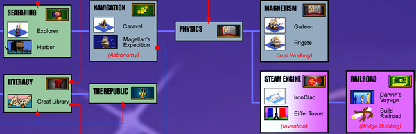

# 三张地图

作为一名高级工程师，你需要开阔的视野。 每次你对事件做出反应、召开会议或向受训者提供建议时，你都需要了解与你一起工作的人以及利害关系。 当你提出一项战略或推进一个项目时，你会想要了解你的组织是如何运作的以及你在此过程中可能遇到的困难。 除非你能走出日常生活，看看你们都应该去哪里，否则你不会对做什么做出好的选择。
在第 1 章中，我们缩小了视野，从宏观上了解什么是高级工程师以及为什么组织需要他们。 我们定义了一些有助于理解员工角色的公理，然后我邀请你执行一项事实调查任务，以解开你自己角色的某些方面：你的报告链、你的范围、你的工作偏好以及你当前的主要关注点。 如果你还没有对你的工作有一个全面的了解，我希望你现在可以了。 但是，如果你曾经在一座新城市中远足或航行过，就会发现了解自己的位置仅仅是个开始。 定向也意味着了解你的周围环境。

## 呃，有人带地图了吗？

在本章中，我们将通过绘制一些地图来描述你的工作和组织的全景图。 地图根据其用途采用不同的形式：例如，你不会尝试在一张地图上包含海拔、选区和地铁导航。 因此，与其将我们拥有的所有信息叠加到一张密集的、难以理解的图片中，不如着手构建三张不同的地图。 它们不会是完美的模型，但它们是思考工作和问自己问题的有用工具，比如你在哪里、你的组织是如何运作的，以及你都在努力做什么。
你可以将其视为一种心理练习——只是思考你的工程组织的一个比喻——或者你可以实际着手绘制这些地图。 与同事比较笔记并查看你不同意哪些地貌和兴趣点可能很有启发性（也很有趣）。
这是我们最终要制作的三张地图：

### 定位器地图：你在这里

我们将从你在更广泛的组织和公司中的位置开始。 上一章我们谈到了你的范围，但要真正理解这个范围，你需要看看它之外的东西。 边界上有什么？ 当你拉远距离时，你所处的世界与其他地方相比有多大？ 可以把它想象成新闻台在主持人身后抛出的地图之一，以提醒你特定地点的位置，并将其放在上下文中。
你需要定位器地图，因为当你深入其中时要客观地对待任何工作是很棘手的。 除非你能保持远见，否则你会觉得当地群体的担忧和决定比你在更大范围内观察时更重要。 所以我们将尝试一些技术来获得这种观点。 你会对自己说实话，哪些你关心的项目会真正出现在公司的大地图上，哪些你不会看到，除非你一路放大。

### 地形图：了解地形

第二张地图是关于地形导航的。 如果你要穿越风景，如果你对前方有充分的了解，就会走得更远更快。 在本节中，我们将查看地图上的一些危险：沿着你组织的断层线的峡谷和山脊，没有人会预料到的地方的奇怪政治边界，以及每个人都避开的难相处的人 避免。 如果前方有流沙，或者需要提防海怪，或者是一片无法逾越的沙漠，沙漠中到处都是之前旅行者被太阳晒得漂白的骷髅，那么在出发之前，你需要非常清楚地标记这些。
尽管存在危险和困难，你可能会发现已经有可通行的路径。 发现这些路径将包括了解你组织的"个性"以及你的领导喜欢如何工作，阐明决策是如何做出的，以及发现官方和"影子"组织结构图。

### 藏宝图：X 标记位置
第三张地图有一个目的地和到达那里的路径上的一些点。 它显示了你要去的地方，并列出了旅途中的一些站点。 航行可能很危险，但如果你有地图，你就能看到你是否离那个巨大的红色 X 更近了。
揭开这张地图意味着要有长远的眼光并评估你的工作目的。 每个项目本身就是一个目标，还是只是通往实际目标的道路上的一个里程碑？ 有时你会发现根本没有目的地，或者有几个不兼容的目的地。 当没有人宣布宝藏是什么，或者每个人都对如何获得宝藏持不同意见时，一名高级工程师可以通过制定愿景或战略、制定决策或以其他方式为组织绘制全新的藏宝图来产生巨大的影响。 但我已经超前了。 现在我们正在寻找发现现有的大局。 创建一个新的将在第 3 章中发生。

### 清除战争迷雾
这三个地图已经存在于你的组织中； 他们只是被遮住了。 当你加入一家新公司时，大部分的大局对你来说都是完全未知的。 开始一份新工作的一个重要部分是建立背景，了解你的新组织是如何运作的，并发现每个人的目标。 可以把它想象成视频游戏中的战争迷雾，你无法在尚未探索的地图部分看到等待着你的东西。 当你四处侦察时，你会拨开迷雾，更好地了解地形，了解你周围的事物，以及是否有狼来骚扰你的村民。 你可以着手揭开所有三张地图中被遮盖的部分，并找到使其他人易于理解该信息的方法。 例如：

- 你的定位器地图可以帮助你确保与你合作的团队真正了解他们在组织中的目的、他们的客户是谁以及他们的工作如何影响其他人。
- 你的地形图可以帮助突出团队之间的摩擦和差距，并开辟沟通的途径。
- 你的藏宝图可以帮助你确保每个人都清楚地知道他们想要达到什么目的以及为什么。

你可以通过日常学习清除地图的某些部分，但你需要刻意着手清除其他部分。 本章的一个核心主题是了解事物的重要性：拥有持续的背景和对正在发生的事情的感觉。 了解事物既需要技巧，也需要机会，在你开始看到你没有看到的东西之前，你可能需要努力一段时间。
让我们从技能开始吧。 大流行期间，我在爱尔兰乡村呆了几个月，并和住在那儿的朋友一起去大自然散步。 起初，我以为我看到了所有可以看到的东西：一束毛地黄或一棵橡树，都是引人注目的美丽事物。 但是我的朋友们看到的比我多。 他们会在一块我不会多看两眼的泥地上停下来，指出一只松貂的脚印。 他们会挑出我认为只是草而不屑一顾的叶子，并注意到它们味道鲜美，带有胡椒味，是觅食者的宝藏。 即使是孩子们也会看到小花或潜入一片我刚好走过的野草莓地。 为什么他们能看到所有这些东西而我却看不到？ 因为他们学会了集中注意力，并且知道自己在寻找什么。
注意意味着对影响你的项目或组织的事实保持警惕。 这意味着不断从你周围的噪音中筛选信息。 如果你能训练你的大脑说"这很有趣！" 并记住你稍后可能需要的事实，你将开始向你的地图添加细节并培养综合新信息的技能。
什么样的事实是有用的？ 任何可以帮助你或其他人了解你的工作背景、驾驭你的组织或朝着你的目标前进的任何事情。 这里有些例子：

- 关于即将推出的营销活动的公司全体会议演示可能暗示你尚未准备好迎接巨大的流量高峰。
- 你的主管要求你承担一个你没有时间做的项目，但你知道你组织中的哪些高级工程师已经准备好抓住机会扩展他们的技能。
- 公司优先事项的转变可能意味着你曾考虑但搁置的平台已成为一项了不起的投资。
- 你的数据库刚刚消失，你还记得收到一封有关网络维护的电子邮件。

随着时间的推移，你将习惯新闻在你的组织中的传播方式以及你应该注意的事项。 你将知道需要阅读哪些电子邮件以及需要参加哪些会议。 如果你的大脑天生就不会"粘"住这样的信息，我建议你挑战自己，记下以后可能有用的事实，让自己养成集中注意力的习惯。 将收集上下文视为一项技能，作为你工作的一部分。
但注意只会让你走这么远。 如果你无权参与影响你工作的决策和讨论，那么关注也无济于事。 虽然你可能知道 Slack 上每天的会议、电子邮件和令人遗憾的@here 消息流，但还有很多其他信息，除非你知道它存在，否则你将无法询问。 你如何进入"事情发生的房间"？ 我将在本章中分享一些策略。

## 定位器地图：获取视角
随着资历的增长，产生真正的影响将意味着能够将你的工作置于更大的背景下，并认识到你的观点在很大程度上受到你所处位置的影响。 （图 2-1 给出的视角可能有点过分。）

图 2-1。 银河系的定位器图（Jean Beaufort 的原始银河图像，CC0）。
当然，与你一起工作的其他人也会有自己的观点：他们的"你在这里"标记将在地图上的其他地方。 如果你想做出正确的决定，你需要能够从其他一些角度来看问题。
你花在任何领域的时间越多，学习你范围内工作的细微差别，它对你来说就会变得越丰富、越复杂。 当你了解人员、问题和目标时，你会更加专注于它们。 这种专注带来了深度和理解，但也带来了一些风险，尤其是对于一名资深工程师而言。
现在让我们来看看其中的四种风险。

#### 优先次序不好

当你周围的每个人都关心同一组事情时，很容易放大这些事情的重要性。 相比之下，存在于你的团队之外的问题可能开始显得简单或不重要。 这就是为什么你会看到团队做出我在第 1 章中谈到的那些局部最大值决策：局部最大值开始变得非常重要。 你花越多时间盯着自己团队的问题，它们就越显得特别、独特，值得特别、独特的解决方案。 有时他们是！ 但是找到一个真正全新的问题是不寻常的。 如果你检查现有技术和先前存在的解决方案，你将花费更少的时间重新发明轮子。

#### 失去同理心

很容易过度关注并忘记世界其他地方的存在，或者开始认为其他技术领域与你丰富、微妙的领域相比微不足道。 这就像你开始通过鱼眼镜头看世界，鱼眼镜头使你面前的事物变得巨大，并将其他一切挤入外围。 你可能会对其他团队正在做的工作失去同理心："他们正在解决的问题很容易。 我一个周末就能解决。"
你使用的词语，你选择解释的事情与你隐含的事情，以及你归因于其他人的动机都会受到你的观点的影响。 这就是为什么工程师很难与非工程师交流的原因。 图 2-2 讲述了一个熟悉的故事，即误解其他人对你的域的了解是多么容易。
同理心的丧失也出现在事件中，团队可能会专注于问题的有趣技术细节，而忘记了用户正在等待系统重新上线。

图 2-2。 很容易对其他人知道的事情失去看法（来源：Randall Munroe 的 https://xkcd.com/2501）。

#### 调出背景噪音

如果一种失败模式是你团队的关注点似乎比其他人的关注点更重要，那么另一种则恰恰相反：你根本不会注意到问题！ 如果你几个月来一直在处理同一个糟糕的配置文件或损坏的部署过程，你可能已经习惯了它，以至于你不再认为它是你需要修复的东西。 同样，你可能没有注意到开始时只是有点烦人的事情慢慢变得更糟。 也许一个问题已经接近危机，但你甚至都没有注意到它，所以你无法客观地判断你需要多快做出反应。^1^

#### 忘记工作的目的

孤立无援可能意味着你与公司其他地方发生的事情失去联系。 如果你的团队最初承担某个项目是为了解决更大的目标，那么即使目标不再重要或已经以其他方式解决，该项目可能仍在进行中。 如果你只处理项目中你自己的一小部分，就很容易停止思考项目的目的。 你可能会进入这样一个世界，每个人都尽自己的一份力量，没有人觉得他们对最终结果负责。 你也可能会忽视你正在做的事情的道德规范，并发现自己正在做一些你不会真正接受的事情，如果你退后一步并考虑整个画面。

### 眼界更大

打开你公司的组织结构图，看看你的团队和你关心的其他人与组织其他部门的联系。 当你扩大你能看到的地图的范围时，你自己的团队可能看起来小了很多，你的"你在这里"图钉可能感觉离行动地点很远。 但如果没有远见，你就无法做出有影响力的工作。 在本节中，我们将了解一些其他技术，以了解全局
站在局外人的角度来看

几年前，当我还是基础设施团队的新成员时，我的同事马克在几周后评论道，"当我描述我们的系统时，你会做出这种面部表情……"当然，我认为一些陈旧的系统需要 被替换，但我没有意识到我的意见如此清晰（粗鲁！）在我的脸上。 两年后，团队的辛勤工作意味着架构得到了极大的改进。 我们为这项工作感到自豪。 我觉得它相当好！ 直到一个新人加入并……把他们的意见清楚地表达在脸上。 那时，我已经成为团队内部人员。 我需要一个更新的"新人"来帮助我再次看到问题。
当你团队中的新人查看架构混乱或一堆技术债务时，他们没有历史背景。 正如我的同事丹娜所说，一个新人总是能看到问题。 他们并没有经历过渐进式的变化和沸腾的青蛙：他们只是看到了原始情况。 没有先入之见，他们可以自由地环顾四周并问："这里到底发生了什么？ 这些有用吗？

> 警告
> 成为新人并不是成为混蛋的许可证。 事后看来很容易说，"这太糟糕了！ 为什么他们不只是……"但是要保持谦逊，并假设一切都是这样的。 亚马逊的首席工程师团队在其社区信条之一中承认了这一点："尊重过去"。

成为新人是获得完整局外人观点的最佳机会，但作为一名资深工程师，你应该始终保持这种观点。 你需要能够像不属于其中一样看待你自己的团队，并对你所看到的内容诚实。 你的技术决策是否只对那些忘记了你的团队之外的世界的人有意义？ 如果你们都停止做你正在做的工作，其他人会注意到或关心多久？ 你是否已经沉迷于这项技术而忘记了你最初的目标是什么？ 一切还好吧？ 接下来的四个部分提供了像局外人一样看待事物的技巧。

#### 逃离回音室

当你发现自己置身于一个回声室中，你遇到的每个人都持有相同的观点，当你与其他群体的同龄人联系并发现他们的一些观点只是……不同时，你可能会感到震惊。
在基础设施角色的底层工作了十多年之后，当我第一次与产品工程团队合作时，我的系统感到震惊。 他们行动迅速，勇于冒险，并认为创造客户喜爱的功能至少与那些具有坚如磐石的可靠性的功能一样重要。 我们的辩论动摇了我的一些坚定信念，使它们更加微妙。
在其他群体中寻找同行是你工作的重要组成部分。 与其他员工工程师建立友好关系。 达到一个你们可以互相说实话的地步，这不会引起争议，因为你们已经建立了如此多的善意。 这包括了解其他团队对你的团队持有的任何负面意见——如果你开始看到他们的评论有什么道理，你就会做得更好。 将其他员工工程师视为你的团队，就像你所属的任何团队一样。
相同的原则适用于所有组织。 在图 2-3 和图 2-4 中，我将每个高级工程师的范围描述为一个组，将每个首席工程师的范围描述为一个组织。 虽然实际结构会有所不同，但关键是要成为比你自己的团队或团体更大的事物的一部分，这样你就可以更客观地了解每个人在做什么。

图 2-3。 一个示例软件工程组织。 这里的每个组包含多个团队。 在这家公司，每个高级工程师的范围都是一个团队，他们认为自己是自己团队的一部分，但也是更大的高级工程师虚拟"团队"的一部分。

图 2-4。 一个公司内部有多个工程组织，每个组织都有一名参谋工程师。 每个首席工程师都在自己的组织中，但也是首席工程师虚拟团队的一部分。
超越工程：与产品人员、客户支持、行政人员等建立关系。 如果你的工作影响了他们或他们的工作影响了你，请友好相处并理解他们的观点。 它会给你一种全新的方式来思考什么对你的部门或你的业务是重要的。

#### 什么才是真正重要的？

与非工程师交朋友在另一方面对你的观点有好处：作为一名工程师，很容易被技术所吸引。 但技术是达到某种目的的手段。 归根结底，你是来帮助你的雇主实现其目标的。 你应该知道这些目标是什么。 你应该知道什么是重要的。
初创公司对什么重要的定义与庞然大物的科技巨头或当地的非营利组织不同。 成熟的产品与早期的产品有不同的需求。 有些目标，因此有些项目，比其他目标更重要。 图 2-5 显示了一个感觉像是宇宙中心的项目在从更大的角度看时如何变得不那么重要。 顺序会随着时间的推移而改变，所以现在要了解什么是重要的。 如果你的客户因为你的产品缺少竞争对手所拥有的核心功能而成群结队地离开，那么现在可能不是推动关注技术债务的时候。 如果一切都一帆风顺并且你期待着成长，那么这可能是确保你的基础稳固的好时机。

图 2-5。 正确看待你的项目。 升级可能是你的组织所做的最重要的工作，但从大局着眼的人不会认为它很重要。
公司的目标超出了其既定目标和指标； 它们包括"继续存在"、"有足够的钱支付给每个人"和"有良好的声誉"。 我的同事，Squarespace 工程运营主管 Trish Craine 称这些为"永远正确的目标"。 这些是你公司非常明显的需求，只有在它们处于危险之中时才会真正说明。 你的组织提供的产品或服务应该有效。 它的客户应该想要使用它。 部署它不应该很慢。 了解你的隐性目标和显性目标。

> 提示
> 随着时间的流逝，你公司的优先事项会发生变化，你的部分地图会再次模糊不清。 要及时了解重要事项，请注意你的团队和其他人的全体会议，要求与你经理的经理进行越级一对一的交流，并找时间与依赖你的客户或团队面对面交流。 如果你不了解你的工作为何（或是否）重要的业务背景，请提出要求。

当目标发生变化时也要注意，因为这可能意味着你的范围或重点应该发生变化。 如果你没有在做最重要的事情也没关系，但你正在做的事情不应该是在浪费你的时间。 如果你无法向自己解释为什么你正在做的事情需要一名资深工程师，那么你可能做错了事。

#### 你的客户关心什么？

Honeycomb 的首席技术官 Charity Majors 经常分发贴纸，上面写着："当用户不开心时，九并不重要。" 这里的"九"是指服务水平目标 (SLO)，这是一种衡量系统可用性的通用机制。 "三个半九的可用性"意味着在 99.95% 的时间里，服务是正常运行的。 SLO 很有用，但正如 Majors 指出的那样，它们并不能说明全部情况。 因为谁来定义"可用"的含义？
微软的工程经理兼前首席工程师 Mohit Suley 谈到他的团队追踪并联系不可靠的 ISP，因为他们的搜索引擎 Bing 无法访问。 崩溃的不是 Bing，但正如 Suley 所说，"用户不会区分 DNS 服务、ISP、你的 CDN 或你的端点，无论它们是什么。 归根结底，有一堆网站可以用，也有一堆不能用。" 你需要从用户的角度来衡量成功。 （如果你的客户是公司内部的其他团队，这仍然适用！）如果你不了解你的客户，你就不会真正了解什么是重要的。

#### 你的问题以前解决过吗？

亚马逊"尊重过去"的宗旨包括提醒"许多问题本质上并不是新问题"。 如果你在创造新事物之前研究其他人已经做过的事情，你会想出更好的解决方案。 请记住，你的目标是解决问题，而不一定是编写代码来解决问题。 在构建新事物之前，花时间了解组织内部和外部已经存在的内容。 ^2^

> **行业视角**
> 了解业内其他人如何解决你正在处理的问题。 你喜欢的出版物和资源将取决于你的兴趣，但我发现这里有一些对体系结构、技术领导力和软件可靠性很有价值。 我喜欢 LeadDev 和 SREcon 会议，并尝试尽可能多地参加。 LeadDev 有一个新的（在撰写本文时）会议轨道，称为 StaffPlus。 我正在主持他们的一些活动，所以我不能完全客观，但我认为这很棒！
> 对于在线对话，我喜欢 Rands Leadership Slack：#architecture 和#staff-principal-engineering 频道是黄金。 LeadDev Slack 的#staffplus 频道在活动期间也非常活跃。
> 我订阅了每月的 InfoQ 软件架构师通讯，以及 VOID 报告和 SRE 周刊。 我每周都会阅读 Raw Signal 时事通讯，了解经理的观点。 我也热切期待季度 Thoughtworks 雷达。
> 无论你在哪个领域，都会有自己的出版物。 使用它们来保持观点并发现你可以在需要时探索的新想法。 他们也会帮助你继续学习。

## 地形图：导航地形
定位器地图提供透视图，但你无法通过它导航。 你需要另一张地图：显示地形的地图。
地质学家研究板块构造，即地球岩石圈的巨大部分（见图 2-6）随着时间的推移相互移动、形成山脉和海沟并引发地震和火山活动的方式。 团队构造具有相似的特性。 当责任领域相互碰撞时，它们形成了一个组织领域，充满了重叠和冲突，山脊和裂缝。

图 2-6。 地球主要构造板块的简化图。 （改编自：Scott Nash，公共领域，https://oreil.ly/UdeNz）。
重组可能会破坏需要密切合作的团队之间的沟通。 负担沉重的团队可以巩固并设置障碍。 一位新的高级领导人可能会引发一场地震，在一夜之间重塑格局。 在一个组织中导航（见图 2-7）需要一张地形图。

### 崎岖的地形

如果你在没有详细地形图的情况下开始执行任务，让我们探讨一下你将面临的一些困难。

#### 你的好想法没有得到牵引

对变革的需求做出正确判断还不到成功的一半。 你必须说服别人你是对的，更难的是，说服他们关心你是对的。 这意味着知道如何在你的组织内建立动力：弄清楚谁可以赞助你的想法或帮助它传播，以及如何让它越过终点线并使其"成为现实"。

#### 在到达那里之前，你不会发现困难的部分

许多看似显而易见的旅程都有一些关键点，没有人想出如何过去。 你可能正在尝试攀登以前击败了许多其他人的悬崖。 高级工程师通常可以克服经验不足的工程师无法克服的障碍，并且你有可能在其他人失败的地方取得成功。 但是，如果你知道人们过去在哪里受阻，你就可以采取不同的方法或首先解决问题中最困难的部分，这样其他人就会相信该项目值得他们付出努力。

#### 一切都需要更长的时间

除非你了解你的组织是如何运作的，否则本应直截了当的决策将需要数月或数个季度的时间。 你组织的计划周期机制也会影响你。 一年中的某些时候，为新项目配备人员或召集所有人支持某个目标会更容易。 如果你在设置季度工程 OKR 后立即宣布一项计划，你将面临一场艰苦的战斗，你可能需要等待一个季度才能看到实现目标的任何进展。

### 了解组织
工程师有时会将组织技能视为"政治"，但这些技能是良好工程的一部分：考虑作为系统一部分的人，清楚你正在解决的问题，理解长期后果，并做出权衡 关于优先事项。 如果你不知道如何驾驭你的组织，那么每一次变革都会变得更加困难。
在本节中，我将介绍一些可以消除迷雾并了解公司地形的方法。 首先要评估你的文化的某些方面，包括记录下来的内容、信任程度、人们是否渴望或犹豫要改变，以及新举措来自何处。 这些知识将设定你对平均旅程的期望：取得进步会容易吗？ 之后，我们将查看将显示在你的地形图上的一些障碍和捷径。

#### 什么是文化？

每当我面试求职者时，他们的第一个问题通常是"这里的文化是什么样的？" 我曾经很难回答； 你甚至从哪里开始？ 大部头已经写了组织文化。 不过，现在我认为大多数时候人们真的在问这些问题：

- 我将拥有多少自主权？
- 我会感到被包容吗？
- 犯错误会安全吗？
- 我会参与影响我的决定吗？
- 在我的项目上取得进展会有多困难？
- 人们……你知道……好吗？

你的公司文化并不是决定这些问题答案的唯一因素：个人和领导层也是其中的一部分。 但组织确实有自己独特的"个性"，所以让我们谈谈文化。
如果你的组织发布了价值观或原则声明，这可以帮助你了解领导者最关心的是什么。 但这些价值观是令人向往的：公司的真正价值观反映在每天实际发生的事情中。
要更多地了解贵公司的工程文化，你可以问自己或与同事讨论以下几个问题。 对于他们中的大多数人来说，没有正确或错误的答案。 如果你的公司一直处于一侧或另一侧，将很难操纵，但两者之间有很大的成功空间。

#### 秘密还是公开？

大家知道多少？ 在秘密组织中，信息就是货币，没有人会轻易泄露。 每个人的日历都是私人的。 Slack 频道仅限邀请。 如果你提出要求，你通常可以访问某些东西，但你必须知道它存在！ 当所有信息都需要知道时，就很难想出创造性的解决方案或真正理解为什么某些事情不起作用。
在开放组织中，你可以访问所有内容（甚至是凌乱的初稿！）。 你可能会因选择要使用的信息而感到决策疲劳。 你可能不知道哪些文件是官方的并且需要采取行动，哪些只是早期的想法。 公开的信息会导致更多的戏剧性事件：坏主意更难被悄悄地关闭。
了解围绕共享的文化期望至关重要。 在一种知识封闭的文化中，如果你转发老板私下告诉你的事情，你将失去老板的信任。 在一家更开放的公司，如果你隐瞒信息或不确保每个人都知道发生了什么，你将被视为政治或不值得信任。

#### 口头还是书面？
什么通过口耳相传分享，什么被记录下来？ 决策涉及多少写作和审查？ 在一些公司中，通常是在走廊谈话中做出重大决定，或者发现你的同事在发布后（或当你被传呼时）建立了一个巨大的新功能。 在其他工作场所，每次软件更改都带有正式的规范、要求、签字和批准清单，你可以预计一次更改需要四分之一的时间。
值得庆幸的是，大多数工作场所都介于两者之间。 如果你喜欢快速对话，那么如果你花时间写下决定，你可能会遇到阻力——而且设计文档长于一页也不会被阅读。 更大、更成熟的公司往往会更慎重地考虑变化。 如果你在其中之一，并且你没有创建变更管理票或设计文档，你会显得草率和不负责任。 我工作过的一个团队有一顶牛仔帽，无论哪个团队成员最后做了一件有点太"狂野西部"的事情，它都会放在办公桌上。 这是深情的，但也是一个很好的提醒。

#### 自上而下还是自下而上？

倡议从何而来？ 在完全自下而上的文化中，员工和团队感到有权做出自己的决定并支持他们认为重要的举措。 然而，当这些举措需要更广泛的支持时，它们就会放慢速度。 如果团队在方向或优先级上存在分歧，则缺乏中央"决策者"可能会导致僵局。
另一方面，在完全自上而下的公司中，人们会发现选择主动权和采取果断行动要容易得多。 不过，这些决定不会是最好的，因为它们缺少当地背景。 工程师可能会感到被控制，并且无权对出现的变化做出反应。
Staff+ 工程师应该相当自主和自我指导，但要确保你的组织同意：如果你的经理希望批准你花时间的地方，如果你不签到，可能会导致冲突。如果你习惯于寻求许可 或工作已交代，然后你转到一家自下而上的公司，你会被视为缺乏主动性并且难以完成任何事情。
如果你知道你的组织倾向于如何运作，你也会知道是否首先将你的想法传达给基层从业者并获得他们的支持，或者是否首先试图说服你当地的主管。
快速改变还是刻意改变？
年轻的公司往往会做出快速决策并突然转向尝试新机会。 随着公司变得越来越大、越来越老，他们需要更长的时间来改变路线。 "快速"的组织可能会被接受像两年迁移这样的长期项目的想法所排斥。 行动迟缓的人会错失低垂的改进机会。
根据你所在的位置，你需要以不同的方式制定你的计划。 如果你身处闪电般移动的地方，你会想要一条能立即显示价值的增量路径。 在更深思熟虑的环境中，你需要表明你已经考虑了整个计划。 这也与口头和书面文化紧密相关。

#### 后门还是前门？

不同群体中的人如何相互交谈？ 信息和请求可能有正式途径，但你的社会文化也增加了非正式渠道。 如果团队中的人都很友好，他们会在有问题时发送 DM，并在喝咖啡时分享想法。^3^
如果一个团队中的工程师可以直接与另一个团队中的工程师聊天，那么做出跨两个团队的决策会更容易。 在某些地方，完成工作的唯一真正方法是通过后台渠道与团队中的某个人"交流"。 如果更典型的做法是先提交申请然后等待，或者将合作想法发送到你的管理链中，直到你和其他团队有一个共同的经理，那么一切都将花费更长的时间——但它也将更加可预测和公平。
了解在你的组织中什么是典型的。 如果大家严格要求只能使用正规渠道，乱问问题会被认为是不礼貌的，而且会因为插队而对你产生不好的评价。 如果后台渠道是完成工作的典型方式，那么你将等待一个月的回复，而你本可以与那个一直在公司宠物邮件列表上欣赏你的猫照片的人聊天。

#### 已分配还是可用？
每个人有多少时间？ 如果团队人手不足且工作过度，你将很难为任何不在现有产品路线图上的新想法找到立足点——最快、最简单的回应就是不真正查看请求就直接说不。 任何无需大量投资即可腾出时间的计划都会对你产生最大的影响。 当你可以独自工作或在一点帮助下工作时，你最有可能取得成功，而不需要让一群忙碌的人来致力于任何新事物。
不忙的团队似乎更容易合作，但他们有一个不同的问题：分配不足的工程师很少能长期保持这种状态。 如果有大量可用的免费自行车，很有可能寒武纪竞争激烈的新草根倡议正在发生，每个倡议都有少量的拥护者。 如果你选择一个新生项目，帮助它完成任务，并说服其他人也支持它，你将产生更大的影响力。
液体还是结晶？
权力、地位和名誉从何而来？ 你如何获得信任？ 一些组织，特别是在学术界和大公司和老公司中，有一个清晰的层次结构：同一群人，在相同的配置中，一起爬升，并有一个相当固定的结构来沟通、决策和分配"好的"。 项目。" 每个人就像晶格中的一个节点：只要你周围的人在向上移动，你也会向上移动。 像这种群里的高层常说，他们从来不求升迁：原地踏步，拿到项目，得到群里的支持，轮到自己升职了。
这种等级制度令年轻的、小的、斗志旺盛的公司深恶痛绝，这些公司声称自己有点像任人唯贤。 让我们现实一点：成功仍然取决于获得机会和赞助，因此它在很大程度上受到刻板印象偏见、群体内偏爱和其他认知偏见的影响。 （请参阅网站 Is Tech a Meritocracy? 了解更多信息。）"流动性"公司提供更多空间来改变你在结构中的位置，但你可能需要努力一点才能获得晋升。 你可能会从一个小组转到另一个小组以寻找影响力大的工作，这样你就可以按照自己的步调前进。 如果你坐等别人给你分配项目，你会等很长时间。
在拥有坚固晶格的团队中，了解自己在层次结构中的位置并知道什么时候可以拥有一个将带你进入下一个层次的项目至关重要。 如果你建议接受一些被指定为其他人的促销项目，你会惹恼别人——一位尝试过这种做法的朋友说他们的老板看着他们"就像我建议偷银器一样"。
尝试使用图 2-8 中的滑块图来思考这七个属性如何影响你的组织的工作方式。 如果你想引起文化变革，通常有可能——只要下定决心——随着时间的推移将滑块推向一个方向或另一个方向。 至少知道他们在哪里，你就会避免一些与主流文化作对的陷阱。

图 2-8。 大多数公司在这些属性中的每一个上都处于中间位置。

#### 权力、规则还是使命？

这是查看你的文化的另一个视角：你的领导者认为什么很重要？ 社会学家 Ron Westrum 在他 2005 年的论文"组织文化类型学"中写道：
通过他们的象征性行动以及奖励和惩罚，领导者传达了他们认为重要的事情。 这些偏好随后成为组织员工的当务之急，因为奖励、惩罚和资源都遵循领导者的偏好。 符合喜好的人会得到奖励，不符合喜好的人会被淘汰。 大多数长期组织成员本能地知道如何阅读时代的迹象，而那些没有很快接受昂贵课程的人。
Westrum 使用三个类别对组织及其对信息流的影响进行了分类（见表 2-1）：
**病态的**
一种以权力和地位为目标、人们囤积信息的低合作文化； 用 Westrum 的话来说，"对个人权力、需求和荣耀的关注"
**官僚主义**
一种以规则为导向的文化，信息通过标准渠道流动并且很难改变； Westrum 写道，这里的重点是"规则、职位和部门地盘"
**生成式**
使命导向、高信任、高合作的文化，信息自由流动； Westrum 将此称为"专注于任务本身"
表 2-1。 Westrum 组织类型学模型：组织如何处理信息（Ron Westrum，"A typology of organizational cultures"）BMJ Quality & Safety 13，no. 2 (2004), doi:10.1136/qshc.2003.009522。

| 病态          | 官僚         | 生成         |
| ------------- | ------------ | ------------ |
| 权力导向      | 规则导向     | 绩效导向     |
| 低合作        | 适度合作     | 高合作       |
| 信使被射杀    | 信使被忽视   | 信使被训练   |
| 推卸责任      | 缩小责任范围 | 分担风险     |
| 不鼓励桥接    | 容忍桥接     | 鼓励桥接     |
| 失败→找替罪羊 | 失败→正义    | 失败→询问    |
| 新颖性被压垮  | 新颖性→问题  | 新颖性被实施 |

DevOps 研究与评估 (DORA) 小组（现在是 Google Cloud 的一部分）表明，强调信息流的高信任文化具有更好的软件交付性能。 越来越多的软件公司旨在拥有一种生成文化，这并不奇怪。 这意味着鼓励合作的跨职能团队，从无可指责的事后分析中学习，鼓励实验，承担有计划的风险，以及打破孤岛。 如果你的组织是这样运作的，你将更容易共享信息和取得进展。
如果你知道你的工作场所是以权力、规则还是使命为导向，你会发现完成工作会更容易。 对有多少人会分享信息、合作、花时间提供帮助和支持新想法的感觉会让你在穿越地形时更安全、更少沮丧。 如果你知道自己身处官僚机构，那么如果你提前计划、遵守规则并尊重指挥系统，你将获得更大的成功。 如果你在一个病态的组织中，你会冒更少的风险——而且当你这样做的时候，你会保护好你的屁股。 推车穿过鹅卵石比穿过光滑的路面更困难。 如果你知道这条路会崎岖不平，你就会预算更多的时间，你就不太可能对你无法控制的情况生气。

#### 注意兴趣点

这使我们回到地形图。 了解你组织的文化可以让你大致了解平均旅程的难易程度。 但要导航，你还需要了解障碍、旅程中的困难部分和捷径。 以下是我所了解的组织领域中的几个兴趣点。

##### 鸿沟

公司的板块构造可以在团队和组织之间形成鸿沟。 例如，图 2-9 描绘了以产品为中心的软件工程团队与为他们提供服务的基础设施、平台或安全团队之间可能形成的峡谷。 群体文化、规范、目标和期望以不同的方式演变，造成了难以沟通、做出决定和解决争端的差距。

图 2-9。 基础设施和产品工程组织之间的鸿沟。
更小的鸿沟甚至可以在组织内部形成。 每个团队定义职责的边缘很少能完美对齐，项目工作和信息可能会在团队之间的间隙中丢失。

#### 要塞

堡垒是团队或个人，他们似乎决心阻止任何人完成项目。 也许你需要他们的认可，但没时间和他们在一起。 或者他们可能是看门人，似乎在他们知道你在问什么之前就认为你的想法不好。 虽然有些要塞是小暴君，但大多数都是善意的。 他们守门是因为他们关心。 他们试图保持代码或架构的高质量，并确保每个人的安全。
要通过堡垒大门，你可能需要携带看门人尊敬的人的赞助信物，或者知道放下吊桥的密码。 （常见的密码包括证明你已经减轻了你提议的变更的所有风险，完成冗长的清单或容量估计，或者用可接受的答案回复大量的文档评论。）另一种选择是一场旷日持久的血战，在那里你争论 每一分并把其他人拉入战斗——赢得其中一个可能是代价不菲的胜利，你几乎后悔尝试过。 或者你可以放弃，绕着堡垒走很长的路，这会使你的旅程变得复杂，并且无法获得守门人本可以分享的任何智慧。

#### 有争议的领土

很难以让每个团队自主工作的方式划定团队界限。 无论你的 API、合同或团队章程多么自以为是，不可避免地会有一些工作是多个团队认为自己拥有的，处理这些争议可能会让人感到有风险。
我曾参与过一个项目，该项目需要将关键系统从一个平台迁移到另一个平台。 迁移这个特定的系统只占我项目的不到 5%，所以我不想花太多时间在这上面——但是当我找人来负责它时，我碰壁了。 该系统的所有权分散在三个团队中，每个团队负责其行为的不同方面。 没有人能告诉我将其迁移到我们的新平台是否安全。 每组说："是的，据我所知，但你也应该问......"并指着下一组。 没有一个可以代表整个系统说话的所有者，我绕着圈子转了一圈，试图建立足够的背景来说服自己迁移会成功。 （它没有。围绕回滚调整三个团队也不是很好。）
当两个或多个团队需要紧密合作时，如果他们对自己想要达到的目标没有同样清晰的认识，他们的项目就会陷入混乱。 缺乏一致性会导致权力斗争和浪费精力，因为双方都试图"赢得"技术方向。 团队职责的重叠使情况变得更糟，使决策制定复杂化并浪费了每个人的时间。

#### 不可逾越的沙漠

当你努力实现你的目标时，你有时会遇到一场其他人认为无法取胜的战斗。 这可能是一个太大的项目或政治上混乱的情况，总是以某些高级人员的否决而告终。 不管是什么，人们以前都尝试过，任何再次解决它的建议都会遇到挫折和无聊。
这并不是说你不应该尝试！ 但是你应该有足够的证据来说服你自己和其他人，这一次会有所不同。 如果你要挑一场可能无法取胜的战斗，那么知道参加是件好事。

#### 铺设的道路、捷径和漫长的道路

致力于提高工程师效率的公司通常会设置流程以确保官方的做事方式也是最简单的方式。 一个例子可能是遵循自助服务清单，以确保新组件可以安全投入生产。 如果你有幸拥有其中一些简单、定义明确的路径，请知道它们在哪里并使用它们。
不幸的是，并不是所有的道路都铺得很好。 很长一段时间以来，在有人告诉我们成功的秘诀之前，我们都曾尝试通过官方方式解决问题：未记录的搜索功能、可以为你设置帐户的管理员，或者负责响应的 IT 人员 给DM。 有时候官方的方式就是大家学不会用的方式。 图 2-10 显示了一条没有通向人们实际想去的大部分地方的铺砌道路； 他们取而代之的是传统路径。 如果你不知道你的组织中有这些山羊踪迹，那么一切都需要更长的时间。 但是当你学习它们时，团队可能会要求你不要记录它们：人们应该使用新的路径，他们坚持，很快就会更好。

图 2-10。 新铺的路很漂亮，但人们真正想去的地方大多在沼泽深处。
你的地图上有哪些兴趣点？
你的地形图上还应该有什么？ 有没有你可以走出的意想不到的悬崖？ 是否存在在其他公司或团队中完全可以但在你的行为或团队中被认为粗鲁的行为或沟通方式？ 是否有你期望到位但实际上没有的护栏？ 是否有容易爆发的地区，或为那些认为自己脚踏实地的人引发地震（或意外重组）的领导人？ 地方政治如何——哪些团队由君主领导，哪些由议会领导？ 哪些是无政府状态？ 谁在与谁交战？
尝试绘制自己的地图。 请记住，制图本质上是政治性的：你选择包含的内容也能说明你的情况。 注意你放在地图中心的东西以及你倾向于支持的地方。
由于重组、收购、个性，以及在某些情况下，彼此不喜欢的人，组织最终会出现奇怪的形状。 如果你想出我没有想到的障碍、信息管道或其他地貌，我很想听听。 ^4^

#### 决策是如何做出的？

观察信息和意见如何在一家公司中流动，以及它们如何出人意料地成为记录计划，真是令人着迷。 突然之间，每个人都在使用新的首字母缩略词或持有特定的观点，而且很难看出这是从哪里来的。 一个充满希望和希望的项目现在因为可能会失败而被驳回。 每个人都对微服务感到兴奋，或者他们已经离开微服务并且对无服务器感到好奇，或者他们认为模块化单体只是务实的常识。 一个团队获准在今年雇用更多人，而另一个团队则没有。 所有这些决定是如何做出的？ 有备忘录吗？
有些决定似乎是在没有人真正宣布他们已经决定的情况下从谈话中产生的。 其他的则更正式，但发生在你不在的房间里。如果你有很多想法，当你看到其他倡议扎根而不是你的倡议时，你可能会感到沮丧。 为什么他们不听你的建议？5 事实是我们很多人都难以接受的事实：在技术上正确的方向只是一个开始。 你也需要说服其他人——而且你需要说服合适的人。
如果你不了解你的组织或公司是如何做出决策的，你会发现自己无法预测或影响它们。 你可能还会发现，你认为自己与其他人对接下来应该发生的事情持有相同的看法，然后突然发现每个人都在提倡一条不同的道路。 如果你一直觉得自己不在圈子里，这表明你不了解决策是如何做出的以及谁会影响它们。

#### "房间"在哪里？

影响你和你的范围的决定每天都在发生，如果你一直被它们震惊，那会很不舒服。 你至少应该知道他们来自哪里，你可能也想对他们产生一些影响。 让我们从做出重大决策的正式渠道和正式会议开始。
根据你在组织层次结构中的位置，你对决策的访问权限会有所不同。 其中一些决定将不可避免地发生在公司比你更高的地方。 你可以通过确保相关信息通过你的报告链或其他渠道到达这些房间来影响他们。 但决策也直接在你的范围内做出，并且你会希望尽可能多地参与其中。 如果你看过音乐剧《汉密尔顿》，你就会记得亚伦伯尔渴望"在它发生的房间里"。 正如伯尔告诉我们的那样，不在场的人"对他们交易的东西没有发言权"。 虽然有时局外人的观点会有所帮助，但这不是其中之一。 如果你想设定技术方向或改变当地文化，你需要成为决策团队的内部人员。
找出决策发生的地方。 也许每周都会举行一次经理会议，旨在做出组织决策，但通常会影响流程或技术方向。 董事可能倾向于在员工会议上与向他们报告的人制定计划。 一个中央架构小组可能有一个 Slack 频道，他们可以在其中就前进的道路达成共识。 如果你不了解你的组织是如何运作的，请让你信任的人带你了解特定决策的来源。 （要清楚你不是在反对这个决定，只是想了解你组织的内部运作方式。）
当心：可能根本就没有"房间"。 在最极端的情况下，重大的技术声明可能会与最高级别的领导者一对一地做出，或者它们可能打算完全自下而上（因此通常根本不会做出）。^6^ 但如果有 为你感兴趣的决策类型设置一个"发生事件的房间"，找出那是什么以及里面有谁。

#### 要求加入

一旦发现可以做出重要决定的会议，自然而然就会想参与其中。 但是你需要一个引人入胜的故事来说明为什么会发生这种情况。 这看起来很明显，但你的理由应该是关于对你的组织的影响，而不是对你个人的影响。 无论你的同事经理多么喜欢你，将你的排斥视为不利于你的职业发展都不太可能改变人们的想法。 展示你的参与将如何使你的组织更好地实现其目标。 展示你可以带来哪些还没有的东西。 清楚地说明你为什么需要访问权限，练习你的谈话要点，然后去申请加入。
你可能会遇到一些阻力。 对于已经存在的人来说，将某人添加到群组中很少是免费的。 任何会议中每多一个人都会减慢会议速度，延长讨论范围，并降低与会者表现出脆弱或残酷诚实的意愿。 如果团队习惯于一起工作，那么每个新人都会重新设置动态； 在某种程度上，与会者必须学会再次合作。
如果你确实收到了邀请，请不要让任何人后悔邀请你。 威尔·拉森 (Will Larson) 的文章"Getting in the Room"强调，除了为房间增加价值外，你还需要降低让你参与进来的成本：做好准备、说话简明扼要，并成为协作、低摩擦的贡献者。 如果你让房间在快速决策或共享信息方面效率降低，你将不会被邀请回来。
如果你不进入房间，不要把它当成个人，尤其是在人们仍在弄清楚他们的员工+工程师的目的并且还没有接受领导角色的组织中。 当他们解决这个问题时，如果你友善且工作出色，你将拥有更大的影响力（并且会显得更像一个领导者），而不是抱怨没有被邀请去做事情。 了解情况，保持友善，并且正如我在第 1 章中所说，永远不要做一个混蛋。
还有一些你不应该在的房间。如果你明确地在个人贡献者轨道上，你通常不应该参与关于薪酬、绩效管理和其他经理轨道事物的讨论。 你可能会向你的经理或主管提供影响这些决定的信息，但这取决于他们采取行动。 如果重大技术决策与经理谈话发生在同一个房间，你可以建议将主题分成单独的会议。
最后，请记住，你试图进入的房间所含的能量可能比你想象的要少。 多年前，我震惊地发现，一群董事并不认为他们的意见有多大分量； 他们对无法影响上两个级别的真正推动者和推动者的决定感到沮丧。 原来还有一个我没想到的"房间"。 上面可能还有其他人！ 对你要求访问的内容要切合实际。

#### 影子组织结构图

这就是正式的决策。 如果你明白这一点，你就会明白你的组织是如何设定自己的观点并决定做什么的。 但不可避免地会有很多其他影响在发生，其中一些从表面上看毫无意义。 非正式决策不遵循基于等级或职位的规则。 这些事情当然很重要，但还有更多事情要做。
虽然了解官方技术领导者是谁很重要，但了解他们听谁的意见以及他们如何做出决策同样重要。 如果你的基础设施组织主管 Jan 似乎完全赞同你的想法，然后突然变得冷淡，会发生什么情况？ 如果你留心观察，你会发现 Jan 在做出任何决定时的第一步是与 Sam 核实，Sam 是 10 年前加入团队的。 山姆不是特别资深，但如果山姆认为某事是个坏主意，你永远不会让简加入。 当你加入一个组织时，这些影响线并不是很明显，所以一个好的早期步骤是结交一些朋友并询问这个组织是如何运作的。
Brian W. Fitzpatrick 和 Ben Collins-Sussman 在他们的《调试团队：通过协作提高生产力》一书中描述了"影子组织结构图"：权力和影响力流动的不成文结构。 影子组织结构图可帮助你了解团队的影响者是谁，它可能与实际组织结构图不同。 这些有影响力的人是你在改变发生之前需要说服的人。
作者确定了认识整个组织的人的"连接器"，以及无论级别或头衔如何，只要在很长一段时间内就发挥影响力的"老前辈"。 这些人很可能对什么行得通和行不通有很好的把握，而有地位和头衔的人可能会信任他们，并在做决定时依赖他们的良好判断。 如果你能得到他们的支持，你就取得了很好的进步。

### 使你的地形图保持最新
我之前谈到了使你的定位器地图保持最新的重要性。 保持地形图新鲜更为重要。 实地的事实会迅速改变，你认为你知道的事情将不再是真的。 通常，你可能需要知道：

- 你依赖的团队有了新的领导。
- 你一直在等待的项目终究没有发生。
- 季度计划即将开始。
- 一个有用的新平台正在启动。
- 你的产品经理即将休假。

有很多信息需要跟上。 但是你需要知道这一切，所以你需要知道要寻找什么。 你可以通过以下方式了解最新信息：

#### 自动公告列表和频道

用于共享新设计文档、宣布中断或链接变更管理票证的专用渠道让每个人都可以轻松地从高层了解正在发生的事情。 如果这些类型的渠道不存在并且你发现它们很有用，请考虑创建它们。

#### 走地板

精益制造人员谈论 gemba，即在制造车间走动并查看实际运作情况的想法。 找到一些途径来专注于你周围的团队正在做的工作。 这可以采取偶尔更改配对、管理事件或为你想了解更多的系统进行部署的形式。 偏离技术太远不仅会减少你的背景； 它会降低你的技术可信度。 （更多内容在第 4 章。）

#### 潜伏

我在 Rands Leadership Slack 上询问了每个人是如何接近了解事物的，一个共同的话题是关注那些不是秘密的信息，但不一定适合你。 这包括阅读高级人员的日历、略读你未参加的会议的议程或笔记，以及——我从未想过的事情——查看按最近创建的 Slack 频道的完整列表，这样你就可以看到有哪些新项目 发生。

#### 腾出时间阅读

在具有成熟文档文化的公司中，计划和变更通常伴随着 RFC、设计文档、产品简介等。 浏览一些基本的上下文，或者在你的日历上安排时间来深入阅读。

#### 与你的领导核实

你需要盟友和支持者来告诉你事情。 经常检查以了解幕后更新并确保你的思维方式仍然与你的领导者的方式保持一致。

#### 与人交谈

出去喝杯咖啡聊天不仅可以建立愉快的关系，还是了解背景的重要来源。 如果你真的想要透视，请与工程以外的人交谈：产品、销售、营销、法律等。 如果你正在创建产品，请与你的客户支持人员交朋友：他们比你更了解你创建的产品。 也要和管理人员交朋友。 管理员聪明、足智多谋且人脉广。 他们知道发生了什么，而且他们往往是公司中最有魅力的人。 去交朋友。

> "我不知道如何与人交谈"
> 许多工程师厌恶任何闻起来像"网络"的东西。 它让我们想起了 80 年代充满活力的午餐。 （或者那只是我？）但是网络不一定是愤世嫉俗或肮脏的。 如果你认识了人并且很友善，那么分享信息和互相帮助就会随之而来。
> 如果你难以与某人开始对话，一个简单的起点是问一个问题，对他们的工作感兴趣，或者（真诚地）称赞你欣赏他们的某些方面。^7^ 大多数人都对谈论感兴趣 他们的工作或他们的优先事项，大多数人会很乐意解释他们感兴趣的事情是如何运作的。 闲聊是一种可以学习的技能，它将在你的整个职业生涯中带来好处。 （如果你正在和比你资历更深的人交谈，你有责任让它不尴尬。）

如果地形仍然难以航行，请成为一座桥梁
阻碍技术组织发展的问题通常是人为问题：不知道如何相互交谈的团队，没有人觉得自己有权做出的决定，以及权力斗争。 这些都是难题！ 当你向地形图添加信息时，你可能会发现在某些地方很想潦草地写下"那里有龙"并发誓要转向别处。 但是，通过去其他人都害怕涉足的地方并使其他人更容易进入危险区域，一名高级工程师通常可以产生最大的影响。
Westrum 模型强调了"桥接"的重要性（见图 2-11），在组织的各个部分之间建立联系，否则就会存在巨大的信息差距。 你对地形了解得越多，就越容易通过发送没人发送的电子邮件摘要、介绍两个本应在一个月前发言的人或编写文档来展示项目如何相互联系来弥合差距。

图 2-11。 当季度计划还有很长的路要走时，员工工程师可以建立联系以弥合两个组织之间的差距。
谷歌的 DevOps 网站建议先发制人地建立桥梁："确定组织中你不了解其工作（或者其工作让你感到沮丧，如采购）的人，并邀请他们喝咖啡或吃午饭。"
如果可以，请定义你的工作范围，使其跨越构造板块并涵盖所有系统或问题领域，而不仅仅是属于单个团队的部分。 这样一来，你就可以抓住被放弃的工作，调解冲突，并帮助创建一个关于正在发生的事情的故事。 当提议进行重大更改时，你将有足够的上下文说"是的，此迁移是个好主意"或"不，我们还有工作要做。"

## 藏宝图：提醒我我们要去哪里？

到目前为止，我们已经绘制了两张地图。 定位器地图显示我们所在的位置。 地形图显示了我们如何在整个组织中导航。 但是我们要去哪里？ 这就是我们制作第三张地图的目的（见图 2-12）。

图 2-12。 X标记的是埋藏宝藏的地方！ 现在你只需要到达那里。
藏宝图为我们提供了一个引人入胜的故事，说明我们要去哪里以及为什么要到达那里。 让我们去冒险吧！

### 追逐闪亮的事物
我在本章前面谈到了你需要如何看待团队的局部问题并保持对周围世界的看法。 你需要跨时间的相同视角。 过度关注短期目标很容易，例如当前的功能发布或最新的不愉快的 App Store 评论。 但想得更大。 你想去哪里？ 你为什么要做这些？ 需要明确的是，我并不是说你不应该寻求短期的胜利。 但只考虑短期目标可能会受到限制。 如果你只考虑短期：

#### 让每个人都朝着同一个方向前进会更难

如果团队不知道大计划，要么他们会走错地方，要么每个决定都会冗长、复杂且充满讨论。 有时，绕过困难意味着走一条间接的道路。 每个人都应该非常清楚在那个里程碑之后需要进行的路线修正。

#### 你不会完成大事

如果你的团队一直专注于解决局部问题和痛点的短期项目，你将无法解决需要多个步骤的更大的长期问题。 团队外的人可能也不清楚现有项目的价值。

#### 你会积累垃圾

如果团队不知道他们要去哪里，他们有两个选择。 他们可以尝试足够灵活以支持未来的每一种状态，创建过于复杂且难以维护的解决方案。 或者他们可以做出局部决策，冒着他们的方向与其他人的方向不一致的风险，并且他们的解决方案将是一个其他人都必须解决的奇怪的边缘案例。

#### 你会有竞争性的举措

在一个依赖基层或自下而上倡议的组织中，可能会有多个人试图围绕完全不同的方向凝聚热情。 他们都在努力做正确的事并让人们保持一致，但最终的结果是混乱。

#### 工程师停止成长

只关注短期目标会限制你思考和构建工作的方式，以及你对落入任务之间的工作的所有权。 如果团队试图完成一个大项目，他们将必须确定分配任务之间的差距，并找出如何填补这些差距，并在此过程中培养技能。 一个习惯于在简短、明确指定的目标上进行迭代的团队不会为更大、更困难的项目锻炼肌肉，也无法讲述他们为什么做他们所做的事情的故事。

### 放眼长远
如果每个人都知道他们要去哪里，生活就会变得更轻松。 一路上不需要保持紧密对齐。 每个团队都可以更有创意地确定自己的路线，对到达那里需要解决的问题进行自己的叙述。 他们不太可能走错路，他们将有足够的信息来做出决定，从而减少他们需要承担的对冲和技术债务的数量。 他们可以一路庆祝胜利，同时记住有一个长期目标，真正的庆祝不会在他们实现之前发生。
你为什么要做你正在做的事？

我经常使用的一个类比是你在许多策略游戏中看到的技术树，比如文明。^8^ 如果你还没有，呃，在这个优秀的游戏上投入太多的时间，我将解释如何 有用。 你扮演一个文明的统治者，试图建立一个帝国。 你的成功之路包括积累科学知识，因此在你前进的过程中，你可以选择研究各种技术。 可用技术集形成一个有向图（见图 2-13）。 一开始你可能会研究陶器和狩猎，但随着游戏的进行，你的技能将相互借鉴。 在文明中，如果不研究桥梁建设和蒸汽机，就无法建造铁路。 如果没有物理学和工程学，你就无法制造蒸汽机。 所以当你在研究物理但你的实际目标是建造一条铁路时，游戏中会有一个点。 在你建造桥梁、研究蒸汽机并为你的火车售票员订购小帽子之前，你不会获得真正的胜利。 （不幸的是，最后一点并没有真正发生。）除非你记得你打算去哪里并继续努力，否则你永远不会坐火车。

图 2-13。 Sid Meier 的《文明 II》中的技术图的一部分，由 Microprose/Activision 创建（来源：http://www.civfanatics.com）。
当你选择一项技术进行投资时，通常是因为它是通向其他事物的道路上不可避免的一步。 你不是为了构建服务网格的乐趣而构建新的服务网格； 你构建它是为了让你的微服务框架更易于使用，因为你想让新服务更容易快速设置，因为你希望团队能够更快地发布功能。 真正的目标是缩短上市时间。 当你知道真正的目标时，你可以退后一步，评估任何提议的工作是否会让你更接近它。

#### 共享地图

你可能需要时间来驱散战争的迷雾并发现你旅程的真正目的地。 一旦你理解了它，就不要把它留给自己。 这意味着将故事讲给其他人听，让他们明白故事的重要性。 你的故事应该展示你在哪里，你要去哪里，以及你为什么要采取你一路走来的步骤。 如果有海怪或要知道的捷径，你可能会想要那些已标记的——但不要包含任何干扰。 让你轻松查看正在发生的事情。 地图应该描述宝藏——即给出成功的明确定义——这样每个人都知道他们的目标是什么。
看到自己正在取得进步是很有动力的，但也很容易忘记自己在哪里，甚至可能觉得自己一事无成。 作为拿着地图的人（见图 2-14），你可以很好地表明每个人都在接近目标（如果没有，则路线正确）。 讲述你从哪里来以及你要去哪里的故事。

图 2-14。 讲述你在哪里，你取得了多少进步以及你要去哪里的故事。
如果藏宝图仍然不清楚，可能是时候画一张新的了
如果每个人都在同一张藏宝图上工作，那么你的工作就完成了。 但是，如果你发现有多条相互竞争的路径或根本没有计划，你可能需要帮助小组选择目的地。 有时，你在这里所需要的只是写一个简短的摘要，说明你发现混乱或不一致的地方。 通过拼写事实并分享它们，你迫使对话（或者，也许是争论）公开化。 但是，在问完所有问题，追踪文明科技树，鼓励不同意的人互相交谈，并认真思考之后，你可能仍然会得出这样的结论：还没有人真正选择了一个长期的目的地，或者 有多个相互竞争的目的地。
在这种情况下，清除地图上的战争迷雾不会有更多收获：是时候创建一张新地图了。 这就是下一章的全部内容。

## 你的个人旅程

在结束本章之前，让我们谈谈你的旅程。 作为一名资深工程师，可能需要更长的时间才能看到你工作的影响。 这意味着讲述该作品的故事更难，但也更重要。 当你回顾过去时，你应该对你试图实现的目标以及它是如何进行的有一个叙述。 你和你的团队一起完成了什么？ 当你展望未来时，你也应该有一个故事：你想做什么？ 你目前的工作如何为实现该目标做出贡献？
一旦你有了这样的叙述，即使是小任务也会成为更大故事的一部分。 任何给定的一周的工作可能都没有说明，但你这个月、这个季度、今年做了什么？ 你离宝藏越来越近了吗？ 要了解你的旅程，你还需要一张地图，即路线图。 我们将在第 9 章中绘制它。

## 回顾一下

- 练习有意识地寻找更大的图景并查看正在发生的事情的技能。
- 在上下文中了解你的工作：了解你的客户，与你团队以外的同事交谈，了解你的成功指标，并清楚什么是真正重要的。
- 了解你的组织如何运作以及如何在其中做出决策。
- 构建或发现路径以允许你获得所需的信息。
- 清楚每个人的目标是什么。
- 想想你自己的工作和你的旅程是什么。

------------------

1. 一个流行的比喻，沸腾的青蛙，说如果你把一只青蛙放进一锅沸水里，它会跳出来，但是如果你把一只青蛙放进冷水里，逐渐增加温度，你可以把水带到 煮沸并杀死青蛙。 它经常被用作一个警示故事，说明渐进的变化可以成为常态，我们可以在不做出反应的情况下滑入灾难。 当我了解到真正的青蛙不会有这样的行为时，我松了一口气：它们只是跳出来！ 让我们不要管可怜的青蛙，但这个比喻很有用。
2. 这也是为什么设计文档应该有一个"考虑备选方案"部分的原因； 我们将在第 5 章中详细讨论设计文档。
3. 共同兴趣的 Slack 渠道、社交俱乐部和员工资源组 (ERG) 是结识他人并在整个组织内建立联系的绝佳方式。 向我在#crosswords 频道工作的朋友们大声疾呼，他们每天分享他们的纽约时报填字游戏时间，并向#women-in-engineering 频道的参与者致敬，他们庆祝每个成员的成功。
4. 如果你身边有五年级学生，我建议你与他讨论地貌问题。 它们非常适合解决诸如"如果峡湾是人类努力合作的隐喻，峡湾会是什么样子？"这样的问题。 （两个团队一起合作做一个大项目——冰川——但他们互相生气，项目融化了，只剩下底部的水。现在你知道了。）
5. 未指定的"他们"通常用作关键字，提醒你你在没有足够信息的情况下进行操作。 如果你发现自己有这样的想法，请仔细检查"他们"指的是谁。 如果它是"整个组织"，那么这就是你的问题的一部分。 准确了解你需要说服谁。 我将在本章后面详细讨论官方决策者和"影子"组织结构图。
6. "协调逆风：组织如何像粘液霉菌"是关于自下而上协调失败模式的精彩演讲。
7. 称赞你欣赏的东西，但请不要告诉你的同事他们很有魅力！ 一般来说，只称赞对方选择去做的事情。 一个写得很好的 RFC，一个顺利进行的会议，或者一个很酷的桌面玩具都是公平的游戏。
8. Civilization 现已推出第六版，是一款已经存在了几十年的策略游戏。 它使用战争迷雾，你必须在长期和短期投资之间做出正确的决定。 我建议玩文明以了解有关人员工程的所有事情。 告诉你的老板这是研究。
