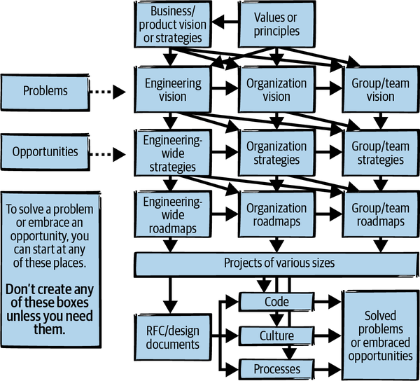
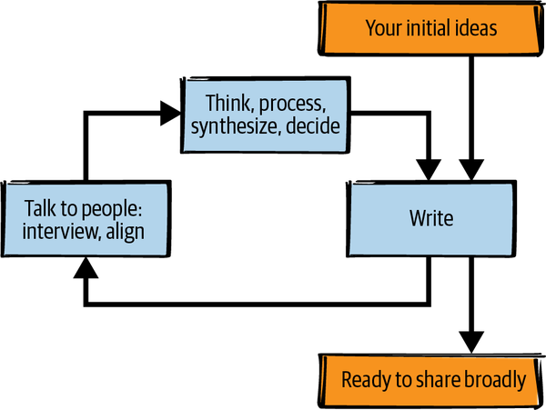
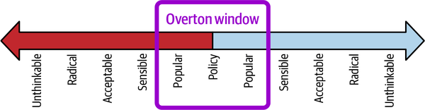

# 创造大局

这是我最喜欢的一个故事，讲述的是一个缺少大局的群体。 我所在的组织即将召开全体会议。 人们可以提前提出主题，并且有一个关于关键系统的问题——我们称之为 SystemX——导致了一些中断。 我被标记为回应。 当我准备谈话要点时，我几乎同时收到了三个 DM：

- 第一条："请让大家放心，我们知道 SystemX 一直是个问题，但我们正在为支持它的团队配备人员，并添加副本以帮助它扩展。 我们预计不会出现更多停电。"
- 与此同时："很高兴有人提出这个问题！ 我们应该强调，SystemX 已被弃用，每个人都应该计划放弃它。"
- 并且："嘿，你能告诉大家我已经成立了一个工作组来探索如何发展 SystemX。 我们将在下个季度宣布计划。 如果有人想加入工作组，他们应该与我联系。"

公共论坛本来是一个很好的机会来传播对这三种非常合理的前进道路中任何一条的认识。 但是为什么会有三个不同的计划呢？
在第 2 章的末尾，我们完成了对贵组织现有藏宝图的发现。 如果你的团队已经有了其中之一——一个令人信服的、易于理解的目标和一个实现目标的计划——你的大局就完成了。 你可以跳到第二部分，我将在其中讨论如何执行大型项目。 但很多时候，参谋工程师发现目标不明确，或者计划有争议。 如果那是你所处的情况，请继续阅读。
在第一部分的最后一章中，我们将讨论创建全局。 当路径未定义且令人困惑时，有时你需要让小组就计划达成一致并创建缺失的地图。 该地图通常以技术愿景的形式出现，描述你想要达到的未来状态，或技术战略，概述你计划如何应对挑战和实现特定目标。 我将首先描述这两个文件，包括为什么你需要每个文件、它们可能采用什么形式以及你可能在其中包含哪些内容。 然后我们将看看如何作为一个小组来创建这种文档。 我们将研究创建文档的三个阶段：方法、写作和发布。^1^ 最后，我们将通过一个虚构的案例研究来了解其中一些技术的实际应用。 现在让我们列出该场景，以便你可以开始考虑如何处理它。

## 场景：SockMatcher 需要一个计划
SockMatcher 成立于几年前，是一家两人创业公司，旨在解决一个重要问题：奇怪的袜子。 丢失一只袜子的人使用该公司的移动应用程序上传图片或视频，后端的复杂机器学习算法会尝试找到另一位丢失了同一双袜子的用户。 如果两个袜子所有者中的一个想要将他们的奇数袜子卖给另一个，算法就会给出一个价格。 袜子所有权的每次更改都在分布式袜子链分类帐中进行跟踪。
正如你想象的那样，风险资本家为之疯狂。^2^ SockMatcher 迅速成长为互联网上最大的奇数袜子市场。 该公司已扩大与多家定制袜子制造商的合作伙伴关系，提供个性化袜子推荐，甚至还有手套和纽扣。 它推出了一个外部 API，第三方可以将其用作袜子分析平台 (SaaaP)。 客户喜欢这些新功能。
公司的架构已经有机地发展。 它全部围绕一个单一的中央数据库和数据模型构建，使用单一的二进制管理登录、帐户订阅、计费、匹配、个性化、图像和视频上传等。 这些功能中的每一个都内置了特定于产品的逻辑。 例如，计费代码包括如何向客户收费的逻辑：袜子每次成功匹配，但按季度订阅按钮。 袜子数据和客户数据存储在同一个大型数据存储中，其中包括有关客户的敏感个人身份信息 (PII)，例如他们的姓名、信用卡号码和鞋码。
出于竞争原因，SockMatcher 优先考虑将新功能快速添加到应用程序中，而不是以可扩展或可重用的方式构建。 例如，该团队将手套功能实现为现有袜子匹配功能的特例，向袜子数据模型添加一个字段以允许将项目标记为"左"或"右"。 当用户上传手套图片时，软件会生成镜像，然后将手套视为另一种袜子。
当公司决定添加按钮匹配时，几位高级工程师认为是时候重新构建和创建一个模块化系统，以便轻松添加新类型的可匹配对象。 不过，业务压力最终胜出，按钮匹配也作为袜子的特例实现，数据模型中的新字段允许指定一组按钮的数量和每个按钮的孔数。 计费代码、个性化子系统和其他组件包含硬编码的自定义逻辑来处理袜子、手套和按钮的差异，大部分实现为散布在整个代码库中的 if 语句。
现在有一个新的拟议业务目标：公司希望扩大规模以匹配食品储存容器和盖子。 该产品将具有与现有产品不同的特征。 与袜子不同，容器及其盖子并不相同。 该团队将需要不同的匹配模型和逻辑以及一整套新的供应商和合作伙伴关系，以便他们可以在没有匹配可用时为客户提供全新的替换盖子或容器。 该公司最新的产品战略平台推测未来会增加耳环、拼图、轮毂罩等。
新的食品储存容器团队已准备好开始确定该功能的范围。 他们并不急于开始在现有的单体中工作：他们真的想用自己的数据存储构建自己的独立匹配微服务。 但即使他们这样做，他们也需要用于身份验证、计费、个性化、安全处理 PII 和其他共享功能的代码——所有这些目前都针对袜子模型进行了优化。 如果他们想自主工作，他们将需要从整体中公开此功能或重新实现它。 两者都需要时间，因此他们预计会有一些压力要求将食品储存容器声明为一种袜子并在现有代码范围内工作，在需要的地方添加更多边缘情况以及手套和按钮。 团队在正确的下一步是什么上存在分歧。

还有一些其他挑战：

- 与第三方共享的 API 没有版本控制，因此很难更改； 随着新的集成计划，这个问题将变得越难解决，剩下的时间越长。
- 用三年前构建它的工程师的话来说，自主开发的登录功能一直是"有点简陋"。 它还有几年的发展空间，但它不是任何人引以为豪的代码。
- 匹配功能是市场上最好的，让客户满意，但有时即使有匹配也找不到匹配。
- 一位团队成员有一个新算法和系统的想法，可以在当前时间的一小部分内找到匹配项。 他们真的很兴奋。
- 负责运营单体应用的团队无法跟上它的增长，并且不断对扩展问题做出反应。 他们每天都会被寻呼数次，以了解磁盘已满、部署失败和软件错误。
- 随着越来越多的工程师在同一个代码库中工作并重用现有功能，出现了更多意想不到的行为，并且用户可见的错误被更频繁地推送。 几乎每个团队和用户都会受到几乎每次中断的影响。
- 出售袜子的名人和有影响力的人导致用户流量激增 100 倍，导致完全中断。 食品储存容器的推出可能会吸引名厨加入该平台，从而进一步增加需求。
- 每一项新功能都会减慢单体的构建时间，而无主的、不稳定的测试也无济于事：构建和部署新版本通常需要三个小时，从而延长了大多数事件。
- App Store 对移动应用的评论开始呈下降趋势； 许多一星评论指出可用性很差。

尽管此场景包含很多问题，但其中许多问题都有直接的技术解决方案。 每个加入公司的新人都会提出改变建议：分片数据存储、控制 API 版本、从单体中提取功能等等。 各种工作组已经启动。 他们总是从一个由 20 个深切关心但不同意的人组成的房间开始，然后陷入没有人有时间关注他们的泥潭。 毕竟，有一些感觉更重要或更有可能成功的特色工作要做。 工程组织似乎无法在任何一项计划背后获得动力。
你会怎么做？ 我们将在本章末尾回到这个场景。

## 什么是愿景？ 什么是策略？
你应该将新功能构建为可重用平台还是作为特定产品的一部分？ 团队应该学习困难的新框架还是坚持使用流行的弃用框架？ 也许每个团队都可以做出自己的决定：分散的决策可以让组织更快地行动并解决自己的问题。 但是当每个团队自己决定时可能会有缺点：

- 可能会出现"公地悲剧"，团队在不与他人协调的情况下追求自己的最佳行动会导致对每个人都不利的结果。 又是局部最大值。
- 共同关注的问题可能会被忽略，因为任何一个群体都没有权力或动机单独解决这些问题。
- 团队可能缺少足够的上下文来做出最佳决策。 采取行动的人可能与体验结果的人不同，或者可能在时间上与他们分开。

当存在未做出的重大决定时，项目会减慢或受阻。 没有人愿意为了做出有争议的决定或选择标准而进行漫长而痛苦的斗争而推迟他们的项目。 取而代之的是，团体做出局部的好的决定来解决他们自己眼前的问题。 每个团队都根据自己的喜好或关于组织技术方向的谣言来选择方向，并经常将这些选择嵌入到他们创建的解决方案中。 推迟重大的潜在问题会使它们更难解决。 ^3^
当组织意识到他们需要解决其中一些重大的潜在问题时，愿景和战略这两个词就会被广泛使用。 你会听到这些可以互换使用并且表示不同的事物。 为了避免术语混淆，让我们从本章中可以使用的一些工作定义开始。

### 什么是技术愿景？

一旦目标实现并且最大的问题得到解决，技术愿景就会描述你希望的未来。 描述工作完成后一切将如何，让每个人都更容易想象那个世界，而不用纠结于到达那里的细节。
你可以在任何范围内编写技术愿景，从整个工程组织的宏伟蓝图到单个团队的工作。 你的愿景可能会从较大范围的文档中继承，并且可能会影响较小的文档（请参见图 3-1 中的一些示例）。
愿景创造了共同的现实。 作为能够看到大局的资深工程师，你可能可以想象你的架构、代码、流程、技术和团队的更好状态。 问题是，你周围的许多其他资深人士可能也可以，而且你的想法可能并不完全一致。 即使你认为你们都同意，也很容易做出假设或掩盖细节，忽略大的意见分歧，直到它们引起冲突。 书面文字的巨大力量使人们更难相互误解。

图 3-1。 根据问题的大小，你可以从工程范围的愿景、团队范围的愿景或介于两者之间的愿景开始。 除非你需要，否则不要创建愿景、战略等。
技术愿景有时被称为"北极星"或"山巅之城"。 它并不打算做出所有决定，但它应该消除冲突或歧义的来源，并让每个人都能选择自己的道路，同时相信他们最终会在正确的地方。

> 编写技术愿景的资源
> 如果你打算撰写技术远景文档，我推荐以下资源：
>
> - Mark Richards 和 Neal Ford (O'Reilly) 的软件架构基础
> - Scott Berkun (O'Reilly) 的《让事情发生》第 4 章
> - "如何为你的团队设定技术方向"，作者：亚马逊的 James Hood
> - "写下我们 3 年的技术愿景"，作者：Eventbrite 的 Daniel Micol

对于愿景的外观没有特定的标准。 它可以是精辟的鼓舞人心的"愿景陈述"句子、20 页的文章或幻灯片。 它可能包括：

- 高层次价值观和目标的描述
- 用于决策的一组原则
- 已经做出的决定的总结
- 架构图

它可以非常详细并涉及技术选择，或者它可以保持高水平并将所有细节留给实施它的人。
无论你创造什么，它都应该清晰和有主见，它应该描述一个现实的更美好的未来，它应该满足你组织的需求。 如果你可以挥动魔杖并完成任务，你的架构、流程、团队、文化或能力会是什么？ 那是你的愿景。

### 什么是技术策略？
战略是行动计划。 这就是你打算如何实现目标，克服一路上遇到的障碍。 这意味着了解你想去的地方（这可能是我们刚刚讨论的愿景！）以及你的道路上的挑战。 当我在本章中使用策略这个词时，我总是指特定的文档，而不仅仅是一种策略性的思考者。
技术战略可能是业务或产品战略的基础。 它可能是技术愿景的合作伙伴文档，或者它可能处理该愿景的子集，可能针对它包含的组织、产品或技术领域之一。 或者它可能完全独立。
就像技术愿景一样，技术战略应该带来清晰度——不是关于目的地，而是关于那里的路径。 它应该以现实的方式解决具体的挑战，提供强有力的方向，并定义团队在此过程中应该优先考虑的行动。 战略不会做出所有决定，但它应该有足够的信息来克服阻止团队到达需要去的地方的任何困难。

> 编写技术策略的资源
> 关于战略的经典书籍是 Richard Rumelt（货币）的 Good Strategy/Bad Strategy。 如果可以的话，我建议你花时间阅读它。 其他重要资源包括：
>
> - 帕特里克·希尔兹 (Patrick Shields) 的"技术战略强力和弦"
> - "做出承诺：解决大型组织中的广泛技术问题"，作者：Mattie Toia
> - 威尔·拉森 (Will Larson) 的"工程策略调查"
> - Eben Hewitt (O'Reilly) 的技术战略模式
> - Rands Leadership Slack，特别是频道#technical-strategy 和#books-good-strategy-bad-strategy

就像技术愿景一样，战略可以是一两页，也可以是 60 页的庞然大物。 它可能包括对世界现状的诊断，包括需要克服的具体挑战，以及应对这些挑战的明确前进道路。 它可能包括一个应该处理的项目的优先列表，也许还有这些项目的成功标准。 根据其范围，它可能包括广泛的、高层的方向或对一组特定困难选择的决定，解释每个选择的权衡。
在 Good Strategy/Bad Strategy 中，Rumelt 描述了"战略的核心"：对问题的诊断、指导政策以及绕过挑战的行动。 让我们看看每一个。

#### 诊断

"这里发生了什么？" 对你的情况的诊断需要比混乱的现实更简单，也许是通过在噪音中寻找模式，或者使用隐喻或心智模型来使问题更容易理解。 你正在尝试将你所处的情况提炼为其最基本的特征，以便真正理解它。 这是困难的。 需要花时间。

#### 指导方针

指导方针是你绕过诊断中描述的障碍的方法。 它应该给你一个明确的方向，让你更容易做出决定。 Rumelt 说它应该简短明了，"一个路标，标明前进的方向。"

#### 连贯的行动

一旦你有了诊断和指导政策，你就可以具体地了解你将要采取的行动——以及你不会采取的行动。 你的行动几乎肯定不仅仅涉及技术：你可能会有组织变化、新流程或团队，或者项目变化。 对此我真的怎么强调都不为过：你将投入时间和人员来采取这些行动，而不是投入到一开始就摆在桌面上的一长串其他想法上。 这种专注可能意味着你和其他人无法做一些你一直很兴奋的事情。 就是这样。
策略应该利用你的优势。 例如，当伦敦的一位工程经理 Isaac Perez Moncho 正在为一家公司编写工程战略时，他希望建立积极的反馈循环。 他告诉我，那家公司的产品工程团队面临着许多问题：缺乏工具、事故太多以及部署不力。 但他有一个优势：一个优秀的 DevOps 团队可以解决这些问题，只要他们有更多时间。 他的指导方针是腾出 DevOps 团队的一些时间。 为他们腾出空间让他们可以自动化流程并腾出更多时间，创造一个积极的反馈循环，让他们可以解决其他问题。 想办法以自我强化的方式扩大你的优势。
最后，战略不是对其他人在完美世界中会做什么的理想描述。 它必须是现实的，并承认你的情况的限制。 无法在你的组织中配备人员的策略是在浪费你的时间。

#### 你真的需要愿景和战略文件吗？

技术愿景和策略带来了清晰度，但在很多情况下它们可能会矫枉过正。 不要为自己做不必要的工作。 如果描述你试图达到的状态或你试图解决的问题很容易，那么你真正想要的可能更像是设计文档的目标部分，甚至是拉取请求的描述。 ^4^ 如果每个人都可以在没有文档的情况下达成一致，那么你可能不需要它。^5^
如果你确定你需要什么东西，想想它应该是什么形状。 适应你的组织需要和支持的内容。 例如，如果缺乏方向导致大家行动迟缓，你可能希望召集一个小组来创建一个抽象的高级愿景，然后更具体地了解如何实施它。 如果你正在为公司发展做准备，你的 CTO 可能会要求你召集一个跨工程团队，并描述你的架构和流程在三年后会是什么样子。 但是，如果你的团队反复陷入某个特定的缺失架构决策中，请不要在哲学上花费太多时间：对阻碍你的特定项目进行调用。
编写技术愿景或策略需要时间。 如果你能以更轻量级的方式实现相同的结果，那就去做吧。 创建你的组织所需要的，仅此而已。

## 方法
创建愿景、战略或任何其他形式的跨团队文档是一个大项目。 会有大量的准备工作，然后是大量的迭代和调整。 请记住，让人们达成一致并不是你与解决问题的实际工作之间的苦差事：达成一致就是工作。 你为项目带来的任何洞察力或大胆的愿景只有在你能让人们与你一起踏上旅程时才有价值。 就像你不会欣赏花在忽略物理定律的工程解决方案上的时间一样，倡导一个你知道你无法说服你的组织去做的项目也不是很好地利用你的时间。
尽管到目前为止，我已经分别讨论了战略和愿景，但在本章的其余部分，我不会对它们进行太多区分。 它们是截然不同的事情，但都涉及将人们聚集在一起、做出决策、带动你的组织并讲述一个故事。 你可以使用相同的方法来创建其他大图文档，例如技术雷达或一组工程值。
创建这些文档中的任何一个都是经典的"1% 的灵感和 99% 的汗水"的努力，但如果你准备得当，你就会增加发布实际使用的东西的机会。 我会谈谈一些可以让你成功的准备工作，然后我会邀请你仔细考虑这些准备工作的输出，评估你是否能成功，并决定是否让项目正式进行。

### 拥抱无聊的想法
我不了解你，但当我刚接触这个行业时，我认为非常资深的工程师是奇才，他们会花很多时间为极其深奥的技术问题提出富有洞察力的改变游戏规则的解决方案。 我把它想象成类似于星际迷航：下一代剧集，曲速核心反物质收容失败即将发生，或者你有什么，每个人都失去了想法，吓坏了，但突然间，Geordi La Forge 或 Wesley Crusher 惊呼道，" 等待！ 如果我们 \<extreme technobabble>" 并在触摸屏上点击八个字符，企业就会在几秒钟内被拯救。 呸！
现实生活有点不同。 好吧，有时"如果我们<极端技术人员>会怎么样"实际上就是答案：尤其是在非常小的公司中，有时你真的会陷入困境，直到有经验的人进来描述解决方案并挽救局面。 但如果周围有资深人士，很可能已经有很多好主意了。 差距在于让每个人都同意该做什么。
当你进入此项目以创建愿景或战略时，请准备好你的工作涉及现有想法，而不是全新的想法。 正如《经理之路》的作者 Camille Fournier 所写：
我觉得写工程策略很难，因为好的策略很无聊，而且写起来有点无聊。 我还认为，当人们听到"战略"时，他们会想到"创新"。 如果你写了一些有趣的东西，那它可能是错的。 这似乎在方向上是正确的，当然大多数策略都是综合的，而且这一点并不经常被提出！
Will Larson 补充道，"如果你无法抗拒将你最出色的想法包含在这个过程中的冲动，那么你可以将它们包含在你的准备工作中。 把你所有最好的想法写在一个巨大的文档中，删除它，然后再也不提它们中的任何一个。 现在……你的头脑已经为接下来的工作清理干净了。"
创造一些感觉"显而易见"的东西在你写的时候可能会让人觉得虎头蛇尾：我们都喜欢带着天才的远见卓识出现并拯救 USS Enterprise！ 但通常需要的是有人愿意权衡所有可能的解决方案，说明该做什么和不该做什么，让每个人都保持一致，并勇敢地做出（可能是错误的！）决定。

### 加入正在进行的探险
如果有人已经在处理你想要创建的文档类型，请不要竞争——加入他们的旅程。 以下是三种方法：

#### 分享线索

你可以在不接管现有项目的情况下发挥领导作用。 建议正式拆分，让你们每个人都有机会以令人信服的方式领导。 例如，一个负责整个项目，而另一个领导该工作中的一些个人计划。 你也可以建议共同领导：轮流担任主要作者，并在工作完成时拆分。 如果领导者对彼此的想法充满热情，并且都朝着同一个方向努力，这可以打造一个非常有效的团队。

#### 跟随他们的领导

把你的自我放在一边，按照他们的计划去做。 如果他们的经验不如你，你可以通过将他们推向正确的方向并帮助使工作尽可能好来产生巨大的影响。 成为头发花白、经验丰富的最佳配角是一个了不起的角色。^6^ 你可以利用你深厚的技术知识来填补他们技能上的空白，例如，探索遗留代码库以准确了解某些东西是如何工作的。 你也可以在他们不在的房间里倡导该计划。支持他们并帮助实现这一目标。

#### 走开

当然，第三种方法是确定没有你的工作也能成功，对它充满热情，然后去找别的事做。 如果项目不需要你，那就找一个需要的人。
当其他人的方向不是你计划去的地方时，很难让他们领导。 科技公司的晋升制度可以激励工程师觉得他们需要"赢得"技术方向或成为项目的代言人。 这种竞争可能会导致"猿类游戏"：支配游戏和政治活动，每个人都试图将自己确立为该领域的领导者，并认为其他人的想法具有威胁性。 它对协作有害，使成功变得更加困难。
我的朋友罗伯特·柯尼斯堡 (Robert Konigsberg) 是 Google 的高级工程师兼技术主管，他总是说："不要忘记，仅仅因为某些东西来自你的大脑并不能使它成为最好的主意。" 如果你倾向于将正确等同于"获胜"，请退后一步，专注于实际目标。 实践视角：他们的方向是错误的，还是只是不同？ 如果这是同事的想法，你会同样努力地倡导你想要的道路吗？ 即使更好，也要警惕以根本不做决定为代价去争取稍微好一点的路径。 正如威尔·拉森 (Will Larson) 所写，"迅速向其他正在努力改进的领导者提供支持。 即使你不同意他们最初的做法，一个值得信赖的领导项目的人几乎总能取得好的结果。"
如果你认为此人的想法或领导力行不通，即使有你的支持，该怎么办？ 虽然有时你需要保持灵活性，但这不应扩展到支持你认为危险或有害的想法。 即便如此，也要尝试加入现有的旅程并改变其方向，而不是从头开始制定竞争计划：你将拥有就位的盟友和已经建立的势头，并且你将从他们迄今为止所做的一切中学习。
如果真的没有办法让多个人在不玩类人游戏的情况下在同一个项目上取得成功，那么考虑去一个有更多可用空间（和更健康的文化）的地方。

### 获得赞助商
除了在最基层的文化中，没有高层支持的任何重大努力都不太可能成功。 愿景或战略可以在没有赞助的情况下开始，但后来将其变为现实将是一个挑战。 即使在早期，赞助商也会帮助澄清和证明工作的合理性。 如果你的主管或副总裁从一开始就支持你的计划，那么你正在创建的是隐含的组织的藏宝图，而不仅仅是你的 - 减少你浪费时间的风险。 赞助还可以为群体增加层次结构，否则这些群体会在尝试达成共识时陷入困境。 赞助商可以设定成功标准，并在决策陷入僵局时充当决胜局。 他们可以提名一名领导或"决策者"——有时称为直接负责人，或 DRI——当团队陷入困境时，他们将拥有最终决定权。 你不一定需要它，但请记住它作为你可用的选项。
获得赞助商可能并不容易。 高管们很忙，你是在含蓄地要求他们为你的提案投入资源、人员和时间，而不是他们打算做的其他事情。 通过为潜在赞助商带来他们想要的东西来最大化你的机会。 虽然对公司有利的提案是一个良好的开端，但如果符合主管自己的目标或解决他们关心的问题，你会走得更远。 找出是什么阻碍了他们的目标，看看你试图解决的问题是否与这些问题一致。 赞助商也会有一些"永远正确的目标"：如果你能让他们的团队更有效率或（真正地）更快乐，这可能是他们支持你工作的一个令人信服的理由。
在试图说服赞助商加入你的项目之前，请考虑并练习你的"电梯游说"：如果你不能用 50 个字说服他们，你可能根本无法说服他们。 我曾经试图说服时任谷歌工程总监的 Melissa Binde 赞助一个我非常关心的项目。 当我试图让它对她也很重要时，我进入了各种细节。 我的演讲根本无法令人信服——但 Melissa 善意地抓住机会进行指导："你讲这个故事的方式不会让我在意，也不会让其他人在意。 再试一次——从不同的角度讲故事。" 她让我尝试了几个不同的项目原理，并告诉我哪些能引起共鸣。 你几乎永远不会有这样的机会，所以你的音调已经打磨好了。
职员+工程师可以成为项目发起人吗？ 根据我的经验，不，不是直接的。 赞助商需要有权决定组织将时间和人员花在什么上，而此类决定通常由当地董事或副总裁决定。
获得赞助后，请充分检查以确保你仍然拥有它。 Reddit 的首席工程师 Sean Rees 说，员工 + 工程师可能犯的最大错误之一就是没有保持他们的高管赞助："我认为这是有害的，因为你可以开始赞助并随着现实的变化而逐渐减弱……然后 在重新对齐的棘手水域中航行。"

### 选择你的核心组
有些人在开始旅程时非常自律，不会被支线任务分心，但我们大多数人都会从一点点责任感中受益。 与其他人一起工作会给你这种责任感。 当一个人分心或萎靡不振时，其他人会保持动力，并且知道你需要检查工作情况可能是一个强大的动力。 在团队中工作还可以让你汇集人脉、社会资本和信誉，这样你就可以接触到更广泛的组织。 你必须努力让每个人都保持一致，但由于最终你需要与整个组织保持一致，让你的核心团队达成一致可以帮助你及早发现潜在的分歧。
旨在招募一个小的核心小组来帮助你创建文档，以及更广泛的一般盟友和支持者小组。 当然，如果你加入了其他人的旅程，你将成为他们核心团队的一员。 （为简单起见，本章的其余部分假定你是领导者。）
你想让谁加入你的团队？ 拿出你的地形图。 你身边需要谁？ 谁会反对？ 如果有异议者讨厌没有他们做出的任何决定，你有两个选择：确保你有足够的支持来反驳他们的反对意见，或者从一开始就让他们参与。 如果你了解他们为什么反对这项工作以及他们希望看到什么发生，那么带他们一起去会更容易。
虽然你可能有许多关心你所写内容并希望提供帮助的同事，但请保持核心团队易于管理：两到四个人（包括你）是最理想的。 时间承诺可以帮助你：如果核心团队的每个人都需要每周投入 8 或 12 小时来完成这项工作，你就可以在不排斥任何人的情况下保持团队的规模。 （这也是让"游客"远离的好方法。）在核心团队之外，你可以提供更轻松的参与：你将采访他们，尝试在你的工作中代表他们的观点，并让 他们审阅早期的草稿。
一旦你有了你的核心团队，就准备好让他们工作吧！ 从一开始就清楚你是认为自己是这个项目的领导者和最终决定者，还是平等中的第一人。 如果你稍后想要使用决胜局权力或拉升排名，请从一开始就突出你作为领导的角色，或许可以在你正在创建的任何启动文档中添加"角色"部分。 但不管你是不是领导，让你的团队有想法，推动项目前进，并讨论它，而不是将所有问题都转给你。 提供领导机会，并确保在他们采取主动时你会提供支持。 他们的动力会帮助你更快地前进，所以不要阻止他们。
至于你更广泛的盟友群体，让他们参与进来：采访他们并使用他们提供给你的信息。 向他们发送有关文档进展情况的最新信息。 邀请他们对早期草稿发表评论。 如果你有一群有影响力的人支持你所做的事情，你的道路就会容易得多，而且他们从整个组织带来的知识也会产生更好的结果。

### 设置范围
当你考虑你要解决的具体问题时，请考虑它们在整个组织中蔓延的程度。 你想影响整个工程、一个团队、一套系统吗？ 你的计划范围可能与你作为高级工程师的角色范围相匹配，但也可能远远超出它。 ^7^
旨在涵盖足够多的领域以实际解决你的问题，但要注意你的技能水平和影响范围。 如果你想对你的网络做出重大改变，那么明智的做法是让网络团队的某个人加入核心小组，并在该团队中建立信誉。 否则，你就是在为冲突和失败做好准备。 如果你试图为公司的一些领域制定计划，而这些领域完全超出了你的影响范围，请确保你有一个对该领域有影响力的发起人——最好是其他一些核心小组成员，他们对这些领域有清晰的了解。 组织。
对可能的事情要务实。 如果你对未来的愿景涉及完全不受你控制的事情，例如更换 CEO 或调整客户的购买模式，那么你已经进入了神奇的思维。 解决你的固定约束，而不是忽略它们或希望它们有所不同。
也就是说，如果你只是为公司的一部分编写愿景或战略，请了解更高级别的计划可能会破坏你的计划。 即使你正在写一些工程范围的东西，业务方向的改变也会使你的所有决定无效。 准备好每隔一段时间重新审视你的愿景，并确保它仍然适合你的组织。 当你在愿景或战略上取得进展时，你可能会发现你的范围发生了变化。 没关系！ 只是要清楚它有。
还要清楚你打算创建哪种文档。 我建议首先让每个核心小组成员明确说明他们希望在工作结束时存在哪些文件、演示文稿或保险杠贴纸。 然后选择对你有意义的文档类型和格式，最重要的是，对你的发起人也有意义。 如果他们热衷于某种特定的方法，请在做其他事情之前进行自我反省。 不要让你的生活变得比它必须的更艰难。

### 确保它是可以实现的

当你思考未来的项目时，你看到了多少大问题？ 是否有你真的不知道如何做出的决定，或者巨大的技术困难？ 有一个或两个问题你不知道如何解决并不意味着你不应该介入，而是要考虑一下这个问题是否可以解决。
你可以在这里采取的一个实际步骤是与以前做过类似事情的人交谈。 问这样的话："我正在写一个愿景/战略，我目前看到三个我还不知道如何解决的问题。 我愿意尝试，但如果这无法解决，我不想浪费我的时间。 你能给我一个直觉，看看我是否会走进死胡同吗？" 或者也许："前面的一切似乎都是可行的，我只有一个问题，但我的老板认为这是浪费时间，希望我完全专注于其他事情。 这值得继续吗？"^8^
也许你认为这个问题很重要并且可以解决，但目前不是你。 有没有教练或导师可以帮助你做到这一点？ 或者这对你的职业生涯来说太大了吗？ 如果你是一名高级工程师，却对首席工程师范围内的问题犹豫不决，这对你来说并不坏：你实际上做了很好的风险分析。
如果在分析结束时，你认为该问题无法解决，或者至少你无法解决，你有五个选择：

- 对自己撒谎，交叉手指，无论如何都要这样做。
- 招募拥有你所缺少的技能的人，要么与他们一起工作，要么让他们领导这个项目（并给你一部分来磨练你的技能）。
- 缩小你的范围，添加固定约束，并用一个不同形式的问题重新开始本章来解决。
- 接受没有人会写一个愿景/战略来解决你能看到的问题，得出结论，如果没有一个，你的公司可能会好起来，然后去做其他事情。
- 接受没有人会写一个愿景/战略来解决你能看到的问题，得出结论，如果没有一个，你的公司就不会好，并更新你的简历。

### 让它正式
在我们继续之前，让我们回顾一下我们一路上提出的那些问题。 这是在开始创建技术愿景或策略之前要考虑的清单。

- 我们需要这个。
- 我知道解决方案会很无聊而且很明显。
- 没有现有的努力（或者我已经加入）。
- 有组织支持。
- 我们同意我们正在创造的东西。
- 这个问题是可以解决的（由我）。
- 我没有在以上任何方面对自己撒谎。

反省一下最后一个问题。 如果你不能选中所有这些框，我的意见是你不应该继续。 如果你将时间花在愿景或战略上而不是其他任何需要员工+工程师的工作上，机会成本就会很高。
不过，如果你真的准备好了，那么还有最后一个问题：你准备好投入这项工作并开始"大声"工作了吗？ 这可能是将愿景或战略创建正式设置为项目的好时机，包括启动文件、里程碑、时间表和报告进度的期望。 如果你有任何拖延或分心的倾向，这些结构尤其重要。
你在这里的透明程度将取决于你对你的组织的了解：想想你在上一章制作的地形图。 如果你能对这样的工作持开放态度，人们就会更容易为你提供信息并倾向于向你提供帮助。 如果你觉得需要秘密制定愿景或战略，请了解原因。 这是否意味着你没有足够的支持？ 你不确定自己的信心和承诺水平吗？ 如果你需要先做一些工作来说服自己你会坚持下去，好吧，我不会评判，但尽快让它正式化。 如果你设定了每个人的期望，你就不太可能遇到竞争性的努力——或者至少你会及早发现它们。

## 写作
准备工作已经完成，项目正式启动，你有赞助商，你有一个核心小组，你已经选择了一种文档格式。 你正在做的工作是有框架和范围的。 是时候真正开始编写文档了。

### 写作循环

在本节中，我将讨论一些实际创建愿景、战略或其他广泛文档的技巧。 我们将着眼于写作、采访人、思考和做出决定，以及在你做的时候保持一致。 这些技术不一定按照我列出的顺序发生。 事实上，你可能会多次执行其中的大部分操作（参见图 3-2），甚至可能会随着视角的变化偶尔回退到"方法"部分中的步骤。
总会有更多信息，所以请注意何时开始从此循环中获得收益递减。 愿景或战略很容易拖延，特别是如果它不是你的主要项目，因此请为这项工作设定时间并给自己一些截止日期。 如果你设置了里程碑，请将它们用作停止迭代和总结的提醒。 不要害怕停下来，即使它并不"完美"：你可以——而且应该——定期重新访问文档，看看上下文发生了什么变化。 如果你遗漏了某些内容，稍后将有机会添加。

图 3-2。 反复编写愿景或战略。

#### 初步想法

以下是你最初考虑制定愿景或战略时可能会问的一些问题。 这些问题只是一个起点：会有很多利益相关者和观点，这只是一个练习，可以帮助你在与他人交谈之前理清思路。
哪些文件已经存在？
如果有包含你的愿景或战略，例如公司目标或价值观或已发布的产品方向，你应该"继承"他们设定的任何限制。 在这里，你的定位器地图的视角将派上用场。 如果你正在撰写一个广泛的技术愿景，你应该知道你的组织希望在未来几年内实现什么。 你所设想的未来应该包括那些现有计划的成功以及为支持这些计划而必须进行的技术变革。
如果有比你的范围更小的团队级或组级文档，也要注意这些文档。 有时，范围更广的愿景或战略不可避免地会导致范围更窄的愿景或战略不得不发生变化，但在考虑权衡取舍时，请了解会造成的破坏并进行权衡。
需要改变什么？
现在有什么困难？ 如果你的团队抱怨被其他团队的依赖所阻碍，你可能想要强调自主性。 如果新功能发布缓慢，也许你想要的是快速的迭代速度。 如果你的产品起起落落，那么你可能需要关注可靠性。
了解你对公司所做的工作后，你的团队应该在哪里投资？ 马克·理查兹 (Mark Richards) 和尼尔·福特 (Neal Ford) 谈论软件中的"架构特性"：可伸缩性、可扩展性、可用性等。^9^ 随着业务扩展或变化，你需要投资哪些特性？
想大点。 如果你在一个需要一天时间来构建和部署的代码库中工作，你可能会希望进行渐进式改进。 "这只需要半天的时间！" 但不止于此。 如果你设定 20 分钟部署的目标，那么朝着该目标努力的团队就会有动力提出更大、更勇敢的想法。 也许他们会考虑更换 CI/CD 系统，或者丢弃一个永远无法与该目标兼容的测试框架。 激发人们的创造力。 （但是，正如我将在本章后面讨论的那样，不要设定你的组织不可能实现的目标。）
有什么好呢？
如果你拥有快速的性能、坚如磐石的可靠性和简单干净的 UI，请确保你的未来状态包括保持一切正常运行。 也许你最终会故意放弃一些伟大的东西来换取你想要更多的东西，但不要无意识地这样做。
什么重要？
你可能注意到了这里的一个模式——到目前为止，这个问题在每一章中都出现过（而且还会再次出现）。 你的愿景或战略将影响许多资深人士的工作。 不要在无关紧要的事情上浪费他们或你的时间。 例如，如果你要让团队进行从一个系统到另一个系统的昂贵迁移，那么最后最好有一个宝藏。 付出的努力越多，宝物就需要越好。
未来的你希望现在的你做了什么？
最后一个！ 我喜欢设想与比我大两三岁（希望更聪明）的未来我对话的技巧。 我会问这个世界是什么样的，我们做了什么，我们希望我们做了什么。 哪些问题每个季度都会变得更糟，如果被忽视，将会变得一团糟？ 如果可以的话，请帮助未来的自己，不要忽视这些。 我称这些恩惠为"送饼干到未来"：这是一份小而真诚的礼物，是你现在的自己送给未来的自己。

#### 写作

在思考完这些问题后，你可能会开始确定主题并对最紧迫的事情发表意见。 这可能是开始粗略初稿的好时机。 不过，请准备好让其他人改变你的想法，并且可能会改变很多。 你将在与其他人交谈并决定下一步做什么时进行编辑和迭代。
集体写作可能很棘手。 这里有两种方法：
让领导写初稿讨论
一个选择是小组的领导者（同样，我假设是你）写一份初稿供讨论。 这种方法非常适合为文档提供一致的声音和一系列关注点。 但是请注意，该草稿将不可避免地受到其作者的兴趣和从属关系的影响。 审稿人和编辑会对其中已有的内容产生偏见，尤其是当撰写它的人比他们更有影响力或资历时。
你可以通过在开始写作之前花大量时间作为一个小组交谈来帮助减轻这种影响。 如果你对某些决定没有强烈的感觉或者甚至是武断的选择，请清楚地指出："我掷了一些骰子并选择了这个方向。 如果我们不能做出决定，我认为这是一个合理的默认。 不过，我敢打赌我们可以做得更好。" 绝对确保任何比你更了解这个系统的人都会放心地反对你。 只有当你非常清楚这就是正在发生的事情时，"强有力的想法被软弱地持有"才有效。
汇总多个初稿
另一种方法是核心小组中的每个人都编写自己的初稿，然后有人将其汇总。^10^ Zapier 的工程总监 Mojtaba Hosseini 告诉我，前一家公司的一个小组采用了这种方法。 他说，拥有多个文件是获得每个人的公正意见的好方法，但一些参与者最终对自己的文件投入了情感，批评他人而不是为他们做出贡献。 该小组没有提名任何人合并草案或在两人意见不一致时充当决胜局。 Hosseini 建议预先明确，这些文件都是对一份最终文件的输入，每个人最终都可以查看——没有任何一份文件会成为"赢家"。 设定关于谁将编写最终版本并调解分歧的期望。

#### 访谈

你的核心小组的想法和意见只会反映该小组成员的经历。 你可能不知道你不知道的关于你所在团队以外的团队的困难——所以把你的成见放在一边，和别人谈谈。 很多人。 不要只选择你已经认识和喜欢的同事：他们很可能在组织上与你非常接近。 寻找其他领域的领导者、有影响力的人和与工作关系密切的人。
早期，你可能会在面试中提出广泛的、开放式的问题。

- "我们正在为 X 制定计划。重要的是要包括什么？"
- 和……一起工作是什么感觉？"
- 如果你可以挥舞魔杖，那会有什么不同……？"

确定工作范围和框架后，你可以通过描述你如何思考该主题、共享正在进行的文件或询问他们对稻草人方法的反应来确定对话范围。 优化以获得尽可能多的有用信息，并让你的受访者感觉自己是你所做工作的一部分。 我总是以"我还应该问你什么？ 我错过了什么重要的事情吗？"
面试还有另一个好处：它向受访者表明你重视他们的想法，并打算将它们包含在你的写作中。 你会听到你没有考虑过的问题和关于你已经知道的问题的新观点。 其他人可能不同意你最大的问题是什么。 保持开放的心态，认真对待他们的想法。

#### 思考时间

无论你和你的团队喜欢处理信息（白板、写作、绘制图表、结构化辩论、静坐并盯着墙壁），请确保给自己足够的时间来做这些事情。 我最好通过写作来思考，所以在制定愿景或战略时，我需要写下我的想法，然后长时间地完善和编辑它们，直到它们对我来说更有意义。 我也从与同事讨论想法、问自己问题并试图找出细微差别中得到很多。 相比之下，我的同事卡尔喜欢用信息填满他的大脑，然后在上面睡觉：他通常会在第二天早上有新的见解。 在某些情况下，你将能够构建原型来测试你的想法。 在其他情况下，该策略将更高层次，你将不得不将结果作为思想实验来进行。
对思想的转变持开放态度。 当你在确定重点领域或要解决的挑战方面取得进展时，你会发现你正在寻找新的方式来谈论它们。 深入了解并帮助它发生。 你建立的心智模型和抽象概念将帮助你思考更大的想法。
思考时间也是检查你的动机的好时机。 请注意，如果你是根据你已经选择的解决方案来描述问题——这对许多工程师来说可能是一个心理障碍。 我们从比较要解决的问题开始，但发现自己在谈论我们"应该"使用的技术或架构，这将使一切变得更好。 正如 Cindy Sridharan 所说，"一位有魅力或有说服力的工程师可以成功地将他们的热情项目作为对组织有益的项目进行销售，而这些好处充其量可能是肤浅的。" 特别注意你在卖给自己的东西！ 在查看你打算做的工作时，问"是的，但是为什么？" 一遍又一遍，直到你确定解释映射回你要实现的目标。 如果连接很脆弱，请诚实。 你的宠物项目的时间会到来。 不是这个。

### 决策
在创建愿景或战略的每个阶段，你都需要做出决定。 本章讨论了许多早期的决定：创建什么样的文件，让谁参与，向谁寻求赞助，如何确定你的抱负，要关注哪些目标或问题，与谁面谈，以及如何安排工作 . 在制定愿景或战略时，你需要权衡取舍，决定如何解决问题，并决定哪些人不会如愿以偿。

#### 取舍

决策之所以艰难，是因为所有的选择都有利有弊。 无论你选择什么，都会有缺点。 提前权衡你的优先事项可以帮助你决定你愿意接受哪些劣势。 这同样适用于优势：每个解决方案都可能对某些东西有好处！
我见过的澄清权衡的最好方法之一是比较你想要的结果的两个积极属性。 我听说过这些被称为 even over 的陈述。 当你说"我们将优化易用性，甚至超过性能"或"我们将选择长期支持，甚至在上市时间"，你是在说，（引用"敏捷宣言"），"虽然有 我们看重右边的物品，我们更看重左边的物品。" 这种框架使权衡清楚。

#### 建立共识

有时，桌面上的任何选项都不能让每个人都满意。 一定要努力达成一致，但不要阻止完全一致：你可能会永远等待，所以你又回到了含蓄地选择现状。 采取互联网工程任务组 (IETF) 的策略，其决策制定原则以拒绝"国王、总统和投票"而赞成他们所谓的"粗略共识"而闻名，认为"没有分歧比达成一致更重要 " 换句话说，抓住群体的感觉，但不要坚持每个人都必须完全同意。 而不是问，"每个人都同意选择 A 吗？" 问，"任何人都不能选择 A 吗？"
当 IETF 工作组做出决定时，他们正在寻求该组的绝大多数人同意，并寻求解决和辩论主要的异议点，即使不是每个人都满意。 可能不会有一个让每个人都开心的结果，他们对此也没有意见。 Mark Nottingham 在由 Stephen Ludin 和 Javier Garza (O'Reilly) 撰写的学习 HTTP/2 的前言中记述了他在这样一个小组中的经历： 所以我们通过掷硬币来做出决定。"
如果粗略的共识不能让你得出结论，而且你还没有准备好掷硬币，那么就需要有人来做决定。 这就是为什么最好预先决定你或其他人是否拥有明确的领导权力并可以充当决胜局。 如果没有人担任该角色，你可以要求你的发起人进行裁决，但这是最后的手段。 你的发起人可能与他们不了解所有背景的决定相去甚远，你会要求他们花费大量时间，而他们最终可能会选择一条没有人满意的道路。

#### 不决定就是一个决定（只是通常不是一个好决定）

当你在选项 A 和选项 B 之间进行选择时，隐含的第三个选项是 C：不做决定。 人们通常默认选项 C，因为它可以让他们保持警惕，不会让任何人感到不安。 这是你能做的最糟糕的事情。 决策限制了可能性，并使取得进展成为可能。 不做决定本身就是维持现状以及周围的不确定性的决定。 虽然无限期地保持你的选择可能会让人觉得它给了你灵活性，但从长远来看，你的解决方案空间仍然很大。 依赖于此的其他决策必须进行对冲，以便为你以后可能最终选择的任何可能方向做好准备。
如果你意识到你需要更多信息才能做出明智的决定，你希望获得哪些额外信息，以及如何获得？ 如果你选择等待，你还在等什么？ 请记住，你通常不需要做出最好的决定，只需做出足够好的决定即可。 如果你被卡住了，那就给它计时。 与其说"我们将选择地球上最好的存储系统"，不如说"让我们研究接下来两周的存储系统，然后在那个时间结束前做出选择。"
有时有很好的理由推迟决定。 出色的决策网站 The Decider 列出了一些：当你需要投入决策的时间和精力不值得决策给你带来的任何好处时，如果做错了会带来沉重的惩罚，而做对了 几乎没有回报，或者当你怀疑情况可能会自行消失时。 但关键是你决定不决定。 你将"不做决定（现状）"添加到你的选项列表中并故意选择它。 你不会只是举起手走开。
当你不确定自己的决定是否正确时，请考虑可能会出错的地方。 你能否包括纠正或减轻任何负面结果的方法？ 做到这一点，即使你错了，也不是一件可怕的事情。

#### 展示你的作品

无论你如何做出决定，都要记录下来，包括你考虑过的权衡取舍以及你最终是如何做出决定的。 不要忽略缺点：非常清楚它们并解释为什么你认为这仍然是正确的道路。 在某些情况下，确实不可能让每个人都开心，但你至少可以证明你已经理解并考虑了所有的论点。 向你的同事提供这些信息不仅是一种尊重，而且还降低了每次新人加入项目并假设你没有注意到他们可以看到的缺点时不得不重新决定的风险。
不幸的是，当你制定战略或愿景时，让某人不高兴是不可避免的。 如果每个人都如愿以偿，那么你就不太可能做出任何真正的决定。 要有同理心，尽可能解决每个人的问题，但要果断做出决定，并说明你为什么选择你的选择。

### 保持一致并保持一致
了解你的最终受众是谁。 你需要说服少数开发人员吗？ 整个公司？ 贵公司以外的人？ 想一想如何让每个小组与你一起踏上旅程。
让你的发起人了解你的计划及其进展情况。 这并不意味着你应该在你还在试图弄清楚你想要表达的观点时向他们发送一份未经编辑的 20 页文件。 花点时间整理一下你的想法，这样你就可以给他们一个总结，说明你是如何处理各种问题的，还有你的选择是什么。 除非他们想看到正在进行的工作，否则请分享你所写内容的亮点，而不是血淋淋的细节。 特别是，如果你正在编写策略，请确保你至少在主要检查点保持一致：在你制定诊断之后，在你选择指导政策之后，以及在你提出一些行动建议之后 . 如果你的发起人认为你走错了路，你会想在花更多时间之前找出答案。

#### 讲道理

你的道路应该是有抱负的，但并非不可能。 有些变化太昂贵，无法证明投资的合理性。 其他努力不会在你的组织中赢得支持。 有一个政治学概念称为奥弗顿窗口（图 3-3）：在公共话语中可以容忍的想法范围，但不会显得过于极端、愚蠢或冒险。 如果你的想法对于你需要相信的人来说太过未来主义，你的同事会拒绝你的文件，你也会失去可信度（更多内容在第 4 章）。 了解你的组织将接受什么，不要进行一场无法取胜的战斗。

图 3-3。 奥弗顿窗口显示在特定时间哪些想法在政治上是可以接受的（来源：基于多伦多卫报的图片）。

#### 根麻纸

如果你在进行过程中让你的利益相关者保持一致，那么你的文档将永远不会与一群第一次了解它的人共享完成的文档。 当我与 Asana 的支柱技术负责人 Zach Millman 谈论在那里制定战略时，他告诉我他使用了 nemawashi 的过程，这是丰田生产系统的支柱之一。 这意味着共享信息并奠定基础，以便在做出决定时已经达成共识。^11^ 如果有人需要对你的计划表示赞同，你会希望这些人 出现在任何已经确信改变是正确的事情的决策会议上。 我一直将此定义为"在你知道你有选票之前不要要求投票"，但我很高兴得知有一个词来形容它。
Keavy McMinn 讲述了一个类似的故事，讲述了她在 Github 时创建的一个策略。 当她准备好与整个公司分享这份文件时，她的老板和他的老板都完全同意了，而且她已经做了大量的幕后准备工作。 决策者已经知道这项工作应该配备人员。 发布该文件仍然围绕工作建立动力和兴奋，并帮助更广泛的受众澄清细节并接受决策。
不要忘记，对齐并不仅仅意味着说服人们相信事情。 它是双向的。 当你讨论你的愿景或战略计划时，这些计划可能会改变。 你可能会意识到很多人对你文档中对你来说并不重要的某些方面很感兴趣，因此你最终将其删除。 你可能会在某些引起冲突的地方妥协，或者特别强调对你来说不是很重要但确实能引起听众共鸣的事情。 你甚至可以合理地找到一个更好的目的地作为目标。 所有这些都很好，这就是为什么编写这样的文档需要时间的原因。

#### 处理你的故事

不是每个人都知道的愿景或战略对你来说价值不大。 当你不在房间里影响他们的决定时，如果人们继续坚持正确的方向，你就会知道方向是很好理解的。 但要做到这一点，你需要让信息进入每个人的大脑。 如果你给你的组织一份很长的文件要记住，你就不能这样做； 你需要帮助他们。 这是我之前提到的简洁的单行或"保险杠贴纸"标语真正闪耀的地方。 Mark Barnes 在他的文章"Making the Case for Cloud Only"中写道，提出"Cloud only 2020"的口号是让金融时报的每个人都容易记住他们的云战略的有力方式。 Sarah Wells 在谈到同样的迁移时补充说，"这肯定是开发人员可以引用我们技术战略的一件事。" 如果你的团队知道、理解并不断重复他们要去哪里的故事，你就更有可能到达那里。
如果你能让人们相信他们想去你描述的地方，你的项目也更有可能成功——并且花费更少的社会资本。 在你写作的时候，想想你的话会如何被接受，并清楚你想要讲述的故事。 回到绘制藏宝图的想法，想象一下你已经完成了，现在你在海盗酒吧，将你的藏宝图在桌子上滚动并试图让你桌上的其他人想要 跟你一起来 你在告诉他们什么？
你想要一个易于理解、相关且舒适的故事。
首先，你要确保故事是可以理解的。 一个简短、连贯的故事比一系列毫无关联的任务更有吸引力。 很难让人们对他们不理解的事情充满热情，而且当你不在场时，你就失去了让他们讲述故事的机会。 即使他们被你的热情所带动，如果他们不真正理解这个计划，他们也无法拥护它。
确保故事是相关的。 宝藏让你兴奋的原因可能对其他人来说一点也不令人兴奋，所以你构建故事的方式真的很重要。 如果你的愿景是你自己的团队将解决最烦人的问题，过上更幸福的生活，吃冰淇淋，那对你团队的人来说是非常有吸引力的。 如果实现该愿景需要其他团队的工作，那么你将需要更多。 展示你的工作将如何改善他们的生活。
同样，记住 Overton 窗口并确保故事是舒适的。 将人们从 A 带到 B 的引人入胜的故事只有在他们实际上在 A 时才有效。如果他们离那里很远，你可能会更成功地说服他们 A，然后等到 在采取下一步行动之前，该想法被认为是明智且被广泛接受的。
你的故事也会帮助人们执行计划。 正如 Mojtaba Hosseini 告诉我的那样，"当遇到困难时，每个人都需要知道困难是可以预料到的，并且可以克服。 不要只是在旅程结束时讲述黄金的故事。 当出现问题时，你需要能够强调这是故事的一部分，英雄们被困在坑里……但他们又出来了！"

#### 创建最终草案
很难相信，当你花了数周或数月时间创建文档时，但并不是每个人都会兴奋地审阅它。 不要生气！ 虽然人们可能有最好的意图，但冗长的文档可能会在选项卡中打开很长时间。 想想如何让它易于阅读，或以其他方式分享亮点。 避免密集的文字墙。 使用图像、要点和大量空白。 如果你能找到一种方法让你的观点清晰易记，就会有更多的人理解它们。
一种方法是使用"人物角色"：描述一些受你的愿景或战略影响的人——开发人员、最终用户或任何利益相关者——并描述他们在工作前后的体验。 另一种方法是描述一个真实的场景，该场景现在对企业来说是困难的、昂贵的，甚至是不可能的，并展示这将如何改变。 尽可能具体。 除非你只向同一领域的工程师展示，否则请避免使用行话。 你的一些读者在遇到一些他们不知道的首字母缩略词或技术术语后会开始调整。
你可能会发现将第二种类型的文档与你编写的文档一起使用会很有用。 如果你要在全体会议或类似会议上发言，你将需要一张幻灯片。 你可能需要一份详细的论文风格或重点突出的文档，以及一页包含高层次想法的电梯演讲。 如果你愿意与公司外部的人分享，你可以写一篇外部博客文章：这也是接触内部受众的另一个机会。

## 发射，市场投入
作为一个人的想法的愿景文件与作为公司或组织正式认可的北极星的愿景之间是有区别的，团队正在努力实现它。 我看到很多文件在这一点上都死了，因为作者不知道如何让它们成为现实。

### 让它正式

你的文件是你的和组织的有什么区别？ 信仰，主要是。 无论你的文档需要什么范围，首先要获得最终权威的认可。 通常这是位于人员-经理链顶端的任何人：你的主管、副总裁、首席技术官或其他高管。 如果你一直在使用 nemawashi 并与意见重要的人保持一致，那么那个人可能已经在船上了。 如果是这样，看看他们是否愿意发送电子邮件，将他们的名字添加到文档中作为背书，在描述下一季度的目标时参考它，邀请你在适当规模的全体会议上展示你的计划，或者让 接受该计划为真实的其他一些公开姿态。 如果你没有他们的支持，请让你的赞助商帮助你推销这个想法。
确保你的文档看起来真实。 将它托管在一个看起来像官方的内部网站上。 关闭所有剩余的评论并删除所有待办事项。 考虑取消添加评论的功能，并留下联系地址以供反馈。 如果你可以将部门负责人或类似人员作为联系人，这将比仅将工程师的名字放在首位更重要。
一份正式认可的文件为人们提供了一个可以用来做决定的工具。 然而，使文档真实存在的另一个重要部分是：实际为其中的工作配备人员。 如果你提出了新项目或跨组织工作，你可能需要人手——以及真正的人来填补这个人手。 如果你需要预算、计算能力或其他资源来完成工作，那么在就方向达成一致的过程中应该会出现这种需求，但现在你将面临实际得到它的现实。 与你的发起人讨论如何在你的常规优先级排序、人数、OKR 或预算流程中工作。
根据你的组织，你可能亲自负责开始执行该策略，或者你可能将其交给其他人来完成工作。 根据我的经验，如果你坚持下去，你们都会更成功，确保工作保持势头，并且随着愿景或战略变成实际项目，计划保持清晰。

### 保持新鲜

实现愿景或战略并不意味着你可以停止思考它。 业务方向或更广泛的技术背景可能会发生变化，你需要进行调整。 你也可能只是发现你选择的方向是错误的。 它发生了。 准备好在一年内重新审视你的文档，如果你意识到它不起作用，则更早。 如果愿景或战略不再能解决你的业务问题，请不要害怕对其进行迭代。 解释你有什么新信息或发生了什么变化，更新它，并讲述一个新故事。

## 案例研究：SockMatcher
是时候回到我们在 SockMatcher 的朋友那里了。 当你阅读本章开头的情景时，也许你对他们应该做什么有了想法。 在某些方面，技术问题很容易解决。 但是，做出影响许多人的改变绝非如此。
假设你是在 SockMatcher 工作的工程师。 这是你的方法、写作和发布的故事。

### 方法

你之前的项目刚刚结束，你正在寻找下一步要做的有影响力的事情，最好是有点牵强的事情。 为公司中最具争议的核心架构制定计划当然符合要求。 这也感觉像是一个重要的问题，可以对业务产生巨大的影响。
你的经理很谨慎。 许多其他人之前曾尝试过解决这个架构——这可能是一个无法穿越的沙漠！ 你建议你花几个星期的时间来理解为什么以前的尝试失败了。 如果你没有令人信服的理由相信你的旅程会有所不同，你就不会这样做。

#### 为什么以前的尝试没有奏效？

你首先与两位工程师交谈，他们过去曾尝试过重新构建整体架构。
第一个，皮埃尔，花了三个月的时间为单体和周围的架构创建了一个详细的技术设计。 其他团队没有留下深刻印象：他们不同意 Pierre 所做的一些权衡，方向与他们自己的组件计划不符，他们不喜欢交给他们实施的解决方案。 由于无法鼓起热情，皮埃尔决定无法解决该项目（至少，目前的工程师团队无法解决）。 他对此仍然很脾气暴躁。
另一位工程师 Geneva 在尝试重新架构之前着手建立一个联盟。 她成立了一个工作组，引起了极大的兴趣。 各个参与者最初都渴望一起工作，但工作组陷入了争论，无法就路径达成一致。 开会的时间变成了一个时间槽，人们不再去，包括日内瓦。
当你与这些和其他对"解决"整体架构有意见的工程师交谈时，你会注意到两种模式。 首先是大多数人都有一个特定的解决方案："问题是我们没有微服务"或"我们只需要对数据存储进行分片"。 每个人都希望他们的解决方案"获胜"，因此不可能达成共识。 第二种模式是每个人都只关注技术问题。 有很多技术上合理的想法，但没有关于如何让组织接受前进道路的计划。
你认为，如果你将组织协调作为问题的症结所在，你会更成功。 你决定找一位执行发起人，并确保你提出的任何方向不仅是好的技术解决方案，而且在这个组织内是可行的。 你会务实和低调，帮助现有的想法取得成功，而不是试图让自己的方向占上风。

#### 赞助

在完成上一个项目后，你在银行中获得了一些社会资本和信誉（见第 4 章），但你知道这不足以说服所有关心单体应用的团队。 你也知道你将不得不做出一些决定，你无法让每个人都开心。 如果你需要完全的共识，你就不会成功。 此外，你制定的任何计划都可能会创建工程项目。 如果你无法为这项工作配备人员，你宁愿早点发现，以免浪费时间。 你需要一个执行发起人。
你从 Jody 开始，他的团队负责运营单体架构：她对简化单体架构的维护有着既得利益。 但她看到她的员工被卷入了前两次改变架构的尝试中，她想捍卫他们的时间。 他们有自己的项目，她不希望他们被另一项新计划分散注意力。 虽然她支持重新架构，但这是一种"我们希望，也许明年"的方式。 她没有兴趣让任何人从事这项工作。
你的下一站是 Jesse，负责食物储存容器发布的主管。 随着这个备受瞩目的项目上线，Jesse 可能更容易获得人员配置，如果你可以将他的成功指标与你自己的指标相结合，他可能会支持这项工作。 当你与 Jesse 交谈时，你描述了一个产品团队可以自主工作、产品工程师更快乐并且新功能可以快速交付的未来。 杰西不确定。 这是一个美好的未来，但食品储存需要在今年推出； 他们迫不及待地想要进行大规模的重构。 你同意：任何解决方案都必须让食品储存人员以最小的摩擦启动。 杰西深信不疑。 他同意赞助和支持你的工作。

#### 其他工程师

你寻找合著者，一些可以为工作带来不同观点和知识的同事。 你还希望在整个组织中建立盟友，并让任何怀疑或反对你的计划的人参与进来。
你从提出详细的先前解决方案的高级工程师 Pierre 开始。 他仍然觉得有点生硬，因为他全心全意地想出一个彻底的解决方案，但遇到了完全冷漠的事情。 他说了一些关于公司领导层的失败（和有点刻薄）的话，并明确表示他认为你的工作是在浪费时间。 你问你是否可以使用他以前的计划作为你正在做的一些工作的输入，将你最终使用的他工作的任何部分归功于他——尽管你设定了对项目范围不同的期望。 他的工作被使用的想法让他更愿意提供帮助。 他仍然不会加入你的团队，但他同意接受采访并稍后审查你的计划。
当你邀请日内瓦加入努力时，你会有更高的希望。 她来了。当她告诉你她以前的工作组仍然存在时，你会感到惊讶，有点像：三名高级工程师每周开会讨论架构。 他们已经对单体问题进行了大量思考，你知道他们将能够看到对你来说不会立即显而易见的细微差别。 你邀请他们组队，要求他们每周工作两天，至少两个月。 一位工程师 Fran 对此表示赞同。 另外两个想提供建议，但不能投入大量时间。 你同意每隔几周回来参加工作组会议并提供最新信息。
你与其他一些潜在盟友联系：

- 食品储存容器项目的团队负责人倾向于认为问题比实际更容易解决，尤其是当涉及到分配给整体维护团队的工作时。 "他们为什么不在单体中构建独立的模块？" 她问。 但如果有计划，她就会参与其中。
- 数据库负责人担心你的项目会给他的团队带来意想不到的工作。 （这是有道理的：有历史。）你保证让他了解情况并让他尽早审查计划。
- 原来写袜子搭配代码的参谋工程师很老，很有影响力。 如果她相信，很多其他人也会相信。 她有一些想法，也想成为早期审稿人。

#### 范围

你的核心小组——你、Geneva 和 Fran——讨论你想做什么以及什么可能会成功。 Fran 渴望为你的所有架构如何发展创建一个技术愿景，但这不是适合你情况的正确选择：你没有那个影响范围，你的发起人也没有。 此外，该范围的项目无法及时准备好启动食品储存。
核心单体架构的愿景如何？ 这将阐明你们要去哪里，但团队在如何到达那里仍然存在分歧。 你决定需要为整体架构制定一个广泛的架构计划，以及一个明确包含食物存储发布的实现策略。 你的目标是描述一年的工作并保持高水平。 你承诺偶尔做出较低级别的技术决策，但前提是该决策没有所有者：你会将大部分实施细节留给将完成这项工作的团队。 而且你的策略必须是正式的：它不能只是一个计划； 它必须是组织选择的计划，否则你不会认为该项目成功。
一旦你们都在同一个页面上，你就写下你要做的事情："制定一个为期一年的高级技术战略，以在发展我们的核心单体架构的同时启动食品储存。" 有点模糊，但这是一个开始！
你更多地谈论范围和问题，收集以前的努力和工作组笔记的链接，并让你自己（和你的共享词汇）保持一致。 你的文件很粗糙，不是你会在核心小组之外分享的东西，但它把你的想法放在一个地方，让你在想到的时候添加额外的想法。
一旦你为你的目标做了一个电梯游说，你就可以和你的赞助商杰西联系。 他支持你正在创建的范围和类型的文档。 他让你的计划正式化的建议是为它添加一个组织 OKR，并将你的名字作为直接负责人 (DRI)。 这有点吓人，但它肯定会给你所希望的官方认可。 他提出要确保 Jody 和其他董事对此感到满意，并添加 OKR。
你为这项工作创建了一个讨论频道，在其他可能有兴趣方的频道中宣布它，并分享关于你的范围和你借鉴的现有技术的笔记。 你强调你想与有意见的人交谈，并且仍然欢迎每周至少有两天时间花在这上面的合作者。 前者有很多，而后者则没有。 你开始列出要与之交谈的人并着手编写你的策略。

### 写作
在你进入解决方案之前，你需要真正清楚你正在解决什么问题。 你的初始范围"创建一个高级的一年技术战略，以在发展我们的核心单体架构的同时启动食品存储"需要更加清晰，但你也不想跳到解决方案。 你需要诊断情况并准确描述正在发生的事情。

#### 诊断

你可以考虑很多事实：

- 目前迫切需要支持食品储存容器的产品，并且有迹象表明未来产品线将进一步扩展。
- 运行单体的团队被分页太多：这是不可持续的，需要改变。
- 你的匹配算法有点慢，但命中率可能更高。
- 你的系统当前未处理流量高峰。
- 用户对你的可用性不满意。
- 登录系统很旧，有很多技术债。
- 部署新代码既缓慢又令人沮丧。
- 外部用户依赖于你希望更改的 API。
- 添加新产品以匹配需要对几个核心组件进行重大逻辑更改。
- 许多开发人员只是不喜欢在单体中工作。

这还不是全部！ 你着手选择最重要的事实并讲述一个更简单的故事。 你的团队花一些时间集思广益，讨论什么是重要的，什么是行不通的，什么是好的。 你想象你未来的自己看着同一个代码库，拥有两倍的工程师和另外五个产品。 如果这些产品也作为边缘案例实施，那么导航每个功能的业务逻辑将变得可怕，并且在该场景中更改任何内容都将变得复杂和令人担忧。 构建会更慢，部署会更频繁地失败。 更多的名人用户意味着更多的中断。 如果你不采取行动，这就是未来。 你最好采取一些行动！
虽然在头脑风暴会议后你有很多想法，但你现在还不想对它们过于执着。 相反，你会与产品团队的一些成员以及工程负责人和从业者聊天，旨在了解对他们来说重要的事情。 你了解到一些新信息：

- 虽然你推测名人代言带来的流量激增可能会导致可用性下降，但过载导致的中断实际上并不常见且时间很短：每月只有几分钟的停机时间。 虽然你当然应该在这方面进行改进，但这些中断并不是导致可用性不佳的最重要因素。^12^ 事实证明，真正的损害是由不起眼的代码错误造成的，而且部署修复需要三个小时。 以前提高可靠性的尝试主要集中在向你的发布路径添加更多测试——但这实际上减慢了部署时间并延长了中断时间。
- 许多工程团队抱怨在单体中工作，但他们真正讨厌的是发布代码。 很大一部分更改具有意外行为。 很难确定你的更改不会破坏其他人，并且修复需要半天时间。 团队因响应中断而紧张不安。
- 迄今为止，计费和个性化子系统是代码库中最具争议的部分。 大多数主要功能更改都伴随着其中一个或两个功能的相应更改，并且它们的逻辑非常复杂，即使进行简单的更改也很容易产生意想不到的副作用。

你也学到了很多东西：与你交谈的每个人都有不同的话题想告诉你。 但是采访建立了一个模式，让你看到发生了什么。 你选择最重要的事实子集并讲述一个更简单的故事。

这是你的诊断：
每个新功能更改都需要对一组共享组件进行复杂的逻辑更改。 修改这些组件既缓慢又困难。 意外的交互意味着团队不断干扰彼此的工作并导致长时间中断。 每一种新的匹配项都会增加这些共享组件内部的耦合点数量，使问题变得更糟。 我们的系统需要能够处理更多的匹配组件和更多的团队来添加它们，而不会停止开发。
选择你的重点可能是编写策略中最痛苦的部分之一。 在这种情况下，未版本化的 API 仍然是一个问题，令人不快的登录代码最终将成为一个问题，改进匹配功能是一个真正的机会，你现在不会尝试。 这些问题和机遇是真实存在的，但你正在做出艰难的决定并暂时忽略它们。
通过诊断，你可以与你的发起人 Jesse 核实，并确保他同意你专注于正确的领域。 你向他展示了你没有关注的挑战清单，以表明你看到了它们，但认为它们不应该放在第一位。 杰西同意。

#### 指导方针

现在你已经清楚地了解正在发生的事情，你可以决定如何应对。
已经有一个拟议的指导政策：你的一些同事正在推动彻底打破整体。 他们说，重新架构将使添加新产品变得更加容易，并减少意外损坏的次数，并减少在出现问题时构建和部署代码修复的时间。 但是团队仍然需要对共享组件进行有风险的更改。 这也意味着所有团队都将开始运行自己的服务，让其中一些团队在他们的生活中第一次随叫随到。 最后，这样的改变也至少需要三年时间，同时没有解决运输产品的问题。 因此，虽然"让我们运行微服务"对于具有不同约束的公司来说可能是完美的解决方案，但它并没有承认当前的情况。
相反，你会查看少量工作可以产生巨大影响的地方。 一个明显的影响点是集成会减慢团队速度的两个关键共享组件：计费和个性化。 如果这两个很容易添加，而不是对每个产品都有硬编码逻辑，其他团队就可以安全地添加新种类的可匹配项目。 中断会更少，团队可以腾出时间来处理功能并进一步改进系统。 这是一个良性循环。
这是你的指导方针：
计费和个性化系统应该易于安全集成。
你也写了一些关于你没有选择的指导政策的笔记。 你描述了你考虑微服务的原因，以及这条道路会带来的优势，但解释了为什么它们不能解决你的问题。

#### 动作

你着手概述你的团队需要采取哪些行动来应对挑战并执行你的指导政策。
重要的是你的行动要切合实际，所以你要与计费和个性化团队以及领导层核实，并确认他们同意你的指示。 计费团队已经有一些积压工作，可以提供其他团队可以通过设置配置选项来选择的计费功能菜单。 个性化人员曾考虑过一个插件架构的想法，该架构具有稳定的核心功能和针对每种类型的可匹配项目的独立逻辑。 添加新项目的团队只需修改他们自己的插件组件。 这两项更改都会使共享组件更加模块化，并支持自助访问它们，并且团队会很乐意花时间在它们上面。
但是，有一个引导问题：这些都是大的、有风险的变化。 重构这些核心组件很可能会导致许多中断，因此团队没有确定工作的优先级。 你建议添加在功能标志后面发布更改的功能，这样回归就可以快速切换回来，而不是另一个部署。 更安全的部署将降低工作的成本和风险。
隔离工作不会在一夜之间完成，同时食品储存团队需要与这两个组件集成。 个性化和计费团队愿意将食品存储视为试点客户并进行优化以使其成功，包括在现有系统中编写集成的第一个版本，并在可用时将其迁移到自助服务模型。 但是这些团队不能以他们目前的人员配置同时承担隔离和集成工作。 Jesse 同意捐出部分已分配给食品储存项目的员工人数，让这两个团队发展壮大。
以下是你的操作：

- 添加功能标记系统，允许分阶段推出和快速回滚。
- 向支付团队添加两名工程师，向个性化团队添加一名工程师。
- 修改计费和个性化子系统，以允许轻松、安全、自助地添加新的可匹配项目。
- 让计费和个性化团队将食品存储产品纳入他们的系统，然后将他们迁移成为新自助服务方法的试点客户。

这些行动是高级别的，所涉及的团队可以自主设计解决方案并做出很多决定。 但这种方法为他们提供了方向和一些具体的后续步骤。 还有很多很多其他的行动建议：与你交谈的每个人都有一份清单，上面列出了他们认为应该做些什么才能让整体变得更健康。 但是你的指导方针让你集中精力并保持简短的清单。
你指定 Fran 作为编写计划的主要作者，你和 Geneva 提出许多建议的修改。 该文件诚实地说明了你的计划的权衡以及你考虑的替代方案以及你不选择它们的原因。
在你与你的发起人达成一致后（他建议对措辞进行一些修改，但总体上是热情的），你通过与你的一些盟友分享初稿来测试你的计划。 有的留下评论。 你亲自采访其他人并消除一些顾虑。
每次讲故事时，你的故事都会变得更紧凑。 你与越来越广泛的群体共享该文档，并开始在一些会议上介绍它。

### 发射，市场投入
老实说：你的计划并没有受到普遍喜爱。 你的一些同事感到不知所措（也许还有点生气）：你的文档并不比他们的任何想法都更"有远见"； 有点无聊！ 有些人坚持认为这个问题不需要策略； 你只需要"决定"做什么，这条路是显而易见的决定。
其他直言不讳的派别不同意你的道路是显而易见的：他们认为这是错误的。 一组仍在争论将一切都转移到微服务。 另一个人希望更多地关注处理负载峰值。 虽然食品储存容器团队可以将他们的一些功能构建为微服务，但他们仍将在单体内部进行大量开发——他们中的一些人对此并不满意。 但是，由于你花时间记录了已知的缺点和你考虑的替代方案，所以这些都不是新闻。 抱怨并没有改变计划。
令人高兴的是，积极的声音更大了。 大多数人都因拥有一个单一的、官方的、商定的方向而充满活力。 从一开始就在旅途中的盟友特别强烈地支持你。 你的工程范围内的 OKR 提高了你的知名度，你的发起人和他的同事与这项工作保持一致并愿意为其配备人员。 你的计划将减轻整体维护团队的一些负担，而不需要他们做出巨大的承诺，因此 Jody 出乎意料地提供了他们的一些帮助：他们将提供功能标志系统。
你明年继续参与该项目，直接参与计费模块化项目，并担任个性化工作的顾问。 在食物储存团队庆祝成功发布后，产品团队立即宣布了一项新的努力来匹配丢失的棋盘游戏。 你的工作意味着棋盘游戏团队将能够使用新的独立功能并开始构建。 有了稳定的系统，整体式维护团队不再需要不断做出反应：他们已经开始致力于改善开发人员的体验，并使系统对负载峰值更有弹性。
通过集中精力，你消除了增长的障碍，以及阻碍每个人发展的障碍。 你已经准备好进行另一个项目了。
继续阅读本书的第二部分，执行。

## 回顾一下

- 技术愿景描述了未来的状态。 技术策略描述了行动计划。
- 像这样的文件通常是集体努力的结果。 虽然创建它的核心团队通常很小，但你也需要来自更广泛团队的信息、意见和一般善意。
- 预先计划如何使文档成为现实。 这通常意味着有一位高管作为发起人。
- 慎重商定文件类型和工作范围。
- 编写文档将涉及与其他人交谈、提炼你的想法、做出决定、写作和重新调整的多次迭代。 需要花时间。
- 你的愿景或策略与你讲述的故事一样好。

---------------

1. 我们专注于愿景和战略，但这些技术可以用于任何大的团队决策：工程价值、编码标准、跨组织项目计划等。
2. 如果有人想谈论种子资金，请给我留言。
3. 你可能会注意到，这些类型的主题在代码和设计审查中仍然占用大量讨论时间，即使它们不是任何特定更改的核心。 如果发生这种情况，或者如果你看到的设计具有相互矛盾的固有假设，则表明你需要做出一些重大的中央决策，独立于任何特定项目或发布。
4. 我将在第 5 章讨论项目执行时讨论这些类型的文档。
5. 尽管如此，Stripe 的一名工程师帕特里克·希尔兹 (Patrick Shields) 曾经告诉我，他鼓励人们为各种各样的事情编写小策略，因为"在进入 NBA 之前，你需要学习打业余篮球。" 这是一个很好的观点。
6. 一个警告：如果你是一个总是退居二线并为他人欢呼的人，请确保你的组织认可这种领导能力。 如果没有，请确保你也有机会大放异彩。 我将在第 4 章讨论信誉和社会资本。
7. 如果你跳到本战略章节并跳过所有"你的工作是什么？" 在本书前面的自省中，你的范围是你认为负责的领域、团队或团队。 它通常涵盖你的经理所涵盖的相同领域，但并非总是如此。
8. 这个问题的答案通常是否定的。
9. 在他们的书《软件架构基础》(O'Reilly) 的第 4 章中有一个完整的列表。
10. 本书的开发编辑 Sarah Grey 说，如果处理不当，这可能会成为编辑的噩梦，而且将所有这些草稿汇总在一起的想法让她很头疼。 如果你走这条路，知道你会进入什么。
11. 正如他所写，你希望在一对一的会议中听到"尖锐的意见"，并在决策者集体开会之前根据需要调整你的计划。
12. 如果放弃一些名人流量被认为是糟糕的公关或错失的机会，你可能会优先考虑它。 上下文就是一切。
