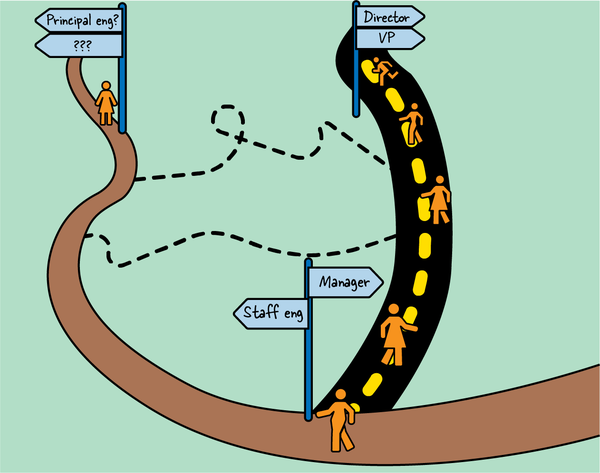
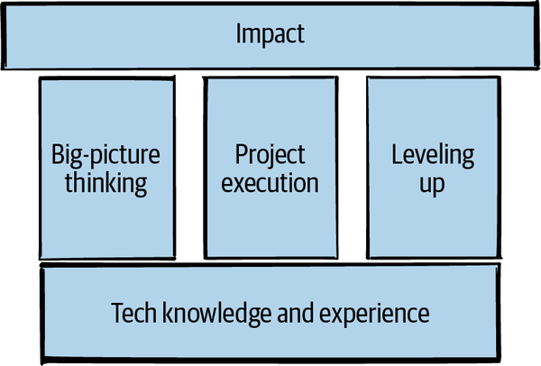
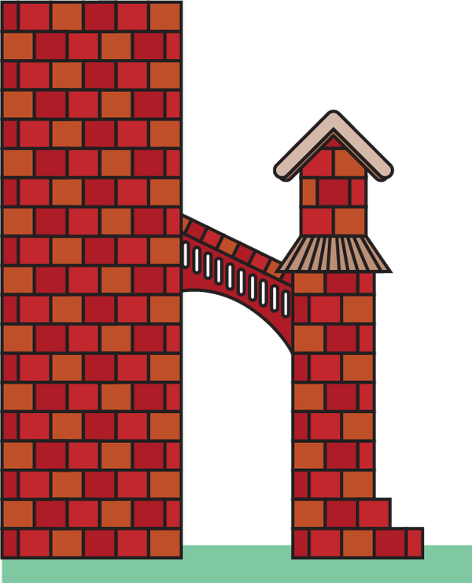

# 介绍

五年后你会在哪里看到自己？ 经典的面试问题是成人版的“你长大后想做什么？”：它有一些社会上可以接受的答案和足够长的时间范围，你不需要承诺。^1^ 但如果你是 作为一名希望在职业生涯中不断成长的高级软件工程师，这个问题就变得非常现实了。^2^ 您认为自己的发展方向是什么？

## 岔路口

您可能会发现自己处在岔路口（图 P-1），两条截然不同的路径在前方延伸。 一方面，您接受直接下属并成为经理。 另一方面，你成为了一个没有报告的技术领导者，这个角色通常被称为高级工程师。 如果你真的能在这两条路上看到未来五年，你会发现它们有很多共同点：它们通向许多相同的地方，而且你走得越远，你就越需要许多 相同的技能。 但是，一开始，它们看起来完全不同。

图 P-1。 岔路口。
经理的道路清晰且人迹罕至。 对于任何能够清晰沟通、在危机中保持冷静并帮助同事更好地工作的人来说，成为经理是一个常见的，也许是默认的职业步骤。 您很可能认识选择这条道路的人。 你以前可能有过经理，也许你对他们做对或做错的事情有自己的看法。 管理学也是一门经过深入研究的学科。 晋升和领导力这两个词通常被认为意味着“成为某人的老板”，而机场书店充满了如何做好这份工作的建议。 因此，如果您踏上管理之路，那将不会是一条轻松的道路，但您至少会对自己的旅程有所了解。
高级工程师的路径不太明确。 虽然许多公司现在允许工程师在不接受报告的情况下继续提高资历，但这条“技术轨道”仍然泥泞不堪，路标不佳。 考虑这条道路的工程师可能以前从未与主管工程师共事过，或者可能在这个角色中看到过如此狭隘的个性，以至于这似乎是无法实现的魔法。 （这不是。这都是可以学习的。）不同公司对工作的期望各不相同，即使在公司内部，招聘或提拔员工工程师的标准也可能很模糊，而且并不总是可行的。
一旦你开始工作，工作往往不会变得更清晰。 在过去的几年里，我与许多公司的员工工程师交谈过，他们不太确定对他们的期望是什么，还有工程经理不知道如何处理他们的员工工程师报告和同事。 ^3^ 所有这些歧义都可能成为压力的来源。 如果你的工作没有定义，你怎么知道你做得好不好？ 或者根本不做？
即使期望很明确，实现它们的道路也可能并不明确。 作为一名新员工工程师，您可能听说过您应该成为一名技术领导者，做出良好的业务决策，并在没有权力的情况下施加影响——但如何做到呢？ 你从哪里开始？

## 员工工程的支柱

我理解那种感觉。 在这个行业 20 年，我一直走的是高级工程师的道路，现在我是一名高级总工程师，在我公司的职业阶梯上与高级主管平行。 虽然我多次考虑过经理的道路，但我总是得出结论，“技术轨道”工作能给我能量，让我想早上来上班。 我想有时间去挖掘新技术，深入理解架构，学习新的技术领域。 无论你花时间做什么，你都会变得更好，而且我一直希望在技术方面不断进步。 ^4^
不过，在我职业生涯的早期，我一直在努力理解这条道路。 作为一名中级工程师，我不明白为什么我们有“高级”以上的级别——那些人整天都在做什么？ 我当然看不到从我所在的位置到这些角色的路径。 后来，作为一名新的参谋工程师，我发现了我不知道如何描述的未说出口的期望和缺失的技能，更不用说采取行动了。 多年来，我从许多项目和经验（成功的和失败的）以及其他公司的杰出同事和同行那里学到了东西。 这份工作现在很有意义，但我希望我当时就知道我现在所知道的。
如果您已经走上了参谋工程师之路，或者正在考虑走这条路，欢迎您！ 这本书是给你的。 如果您与一名工程师共事或管理一名工程师，并且想更多地了解这个新兴角色，那么这里也有很多内容适合您。 在接下来的九章中，我将分享我所学到的关于如何成为一名优秀的工程师的知识。 我现在要警告你，我不会对每个话题都做出规定，也不会回答每个问题：很多模糊性是角色固有的，答案通常是“这取决于上下文”。 但我将向您展示如何驾驭这种歧义，了解什么是重要的，并与您共事的其他领导者保持一致。
我将通过查看我认为的三大支柱来解开主管工程师的角色：大局思维、项目执行和提升与你共事的工程师的水平。
***大局观***
大局观意味着能够退后一步并采取更广阔的视野。 这意味着超越眼前的细节并理解你所处的环境。这也意味着超越当前时间思考，无论这意味着启动为期一年的项目、构建易于退役的软件，还是预测你的公司将需要什么 三年后.^5^
***执行***
在员工层面，你承担的项目会变得更加混乱和模糊。 他们将涉及更多的人，需要更多的政治资本、影响力或文化变革才能成功。
***升级***
资历的每一次增加都伴随着更多的责任来提高你的轨道内工程师的标准和技能，无论是你当地的团队、你组织中的同事，还是整个公司或行业的工程师。 这种责任将包括通过教学和指导产生的有意影响，以及作为榜样产生的偶然影响。
我们可以将这三个支柱视为支持您的影响，如图 P-2 所示。

图 P-2。 职员工程师角色的三大支柱。
您会注意到，这些支柱建立在坚实的技术知识和经验基础之上。 这个基础很关键。 你的大局观包括理解什么是可能的和有良好的判断力。 在执行项目时，您的解决方案需要实际解决他们打算解决的问题。 作为榜样，你的评审意见应该让代码和设计变得更好，你的意见需要经过深思熟虑——你需要是对的！ 技术技能是每个工程师角色的基础，您将不断锻炼它们。
但是技术知识是不够的。 在这个级别上的成功和成长意味着你要做的不仅仅是技术技能。 要善于全局思考、执行更大的项目并提升周围的每个人的水平，您将需要“人性化”技能，例如：

- 沟通与领导
- 驾驭复杂性
- 正确看待你的工作
- 指导、赞助和授权
- 构建问题，以便其他人关心它
- 无论您是否喜欢领导者，都要像领导者一样行事^6^

将这些技能想象成您在哥特式大教堂上看到的飞扶壁（如图 P-3 所示）：它们不会取代墙壁——或您的技术判断——但它们允许建筑师建造更高、更宏伟、更令人惊叹的建筑 建筑物。

图 P-3。 领导技能就像让我们保持大型建筑物稳固的飞行扶壁。
三大支柱中的每一个都有一套必需的技能，你对每一个支柱的能力都会有所不同。 我们中的一些人在领导和完成大型项目时可能很在行，但发现在两个战略方向之间做出选择令人生畏。 其他人可能有强烈的直觉来了解公司和行业的发展方向，但在处理事件时很快就会失去对房间的控制。 还有一些人可能会提高与他们共事的每个人的技能，但很难就技术决策达成共识。 好消息是，所有这些技能都是可以学习的，而且您可以熟练掌握这三大支柱。
本书分为三个部分。

## 第一部分：大局观

在第一部分中，我们将探讨如何在考虑您的工作时采取广泛的战略观点。 第 1 章将从提出有关您的角色的重要问题开始。 对你有什么期望？ 职员工程师有什么用？ 在第 2 章中，我们将进一步缩小并获得一些视角。 我们将在上下文中查看您的工作，浏览您的组织，并揭示您的目标是什么。 最后，在第 3 章中，我们将着眼于通过创建技术愿景或战略来增加全局。

## 第二部分：执行

第 II 部分从战术上入手，转向领导项目和解决问题的实用性。 在第 4 章中，我们将探讨选择工作内容：我将分享有关如何决定将时间花在什么上、如何管理你的精力以及如何以某种方式“花费”你的信誉和社会资本的技巧 这并没有减少它。 在第 5 章中，我将讨论如何领导跨团队和组织的项目：为成功做好准备、做出正确的决策并保持信息畅通。 第 6 章将着眼于克服一路上遇到的障碍，庆祝成功完成的项目，以及回顾（但仍在庆祝！）如果它被取消并彻底关闭。

## 第三部分：升级

第三部分是关于升级您的组织。 第 7 章将通过模拟伟大工程师的行为、如何大声学习以及如何建立心理安全的文化来提高每个人的游戏水平。 我们将研究如何在事件或技术分歧期间成为“房间里的成年人”。 第 8 章是关于提高同事技能的更有目的性的形式，例如教学和辅导、设计审查、代码审查和文化变革。 最后，第 9 章将探讨如何提升自己：如何保持成长以及如何思考自己的职业生涯。 在你目前的角色之后你会去哪里？ 我将讨论一些选项。
在我们走得更远之前的一个警告：这是一本关于停留在技术轨道上的书。 这不是一本技术书籍。 正如我所说，您需要扎实的技术基础才能成为一名资深工程师。 这本书不会帮助你做到这一点。 技术技能是特定领域的，如果你在这里，我假设你已经拥有——或者正在着手学习——你需要的任何专业技能，才能成为你所在领域最资深的工程师之一。 无论“技术”对您来说是指编码、架构、用户体验设计、数据建模、生产操作、漏洞分析还是其他任何东西，几乎每个领域都有大量的书籍、网站和课程可以为您提供支持。
如果您认为技术技能是唯一重要的，那么您不太可能在这里找到您想要的东西。 但是，具有讽刺意味的是，您也可能是从本书中获益最多的人。 无论您的技术知识多深奥，当您能够说服其他人采纳您的想法、提升您周围的工程师的水平并轻而易举地解决让每个人都放慢脚步的组织僵局时，您会发现工作变得不那么烦人了。 这些技能学习起来并不容易，但我保证它们都是可以学习的，我会在本书中尽我所能来指明方向。
你想成为一名职员工程师吗？ 不渴望担任更高级的工程职位很好。 转到经理轨道（或来回走动！），或留在高层，做你喜欢的工作也很好。 但是，如果您喜欢帮助实现组织目标并继续增强技术实力同时让您周围的工程师更擅长他们的技术的想法，请继续阅读。

## O'Reilly 在线学习

> 笔记
> 40 多年来，O'Reilly Media 提供技术和业务培训、知识和洞察力来帮助公司取得成功。

我们独特的专家和创新者网络通过书籍、文章和我们的在线学习平台分享他们的知识和专长。 O'Reilly 的在线学习平台让您可以按需访问实时培训课程、深度学习路径、交互式编码环境，以及来自 O'Reilly 和 200 多家其他出版商的大量文本和视频。 欲了解更多信息，请访问 https://oreilly.com 。

## 如何联系我们

请将有关本书的评论和问题发送给出版商：
奥莱利媒体公司
1005 Gravenstein 公路北
塞瓦斯托波尔, CA 95472
800-998-9938（美国或加拿大）
707-829-0515（国际或本地）
707-829-0104（传真）
我们有本书的网页，其中列出了勘误表、示例和任何其他信息。 您可以通过 https://oreil.ly/staff-eng-path 访问此页面。
发送电子邮件至 bookquestions@oreilly.com 发表评论或询问有关本书的技术问题。
有关我们的书籍和课程的新闻和信息，请访问 https://oreilly.com。
在 LinkedIn 上找到我们：https://linkedin.com/company/oreilly-media。
在 Twitter 上关注我们：https://twitter.com/oreillymedia。
在 YouTube 上观看我们：https://youtube.com/oreillymedia。

## 致谢
感谢许许多多帮助这本书成为现实的人。
感谢 Sarah Grey，所有可能的开发编辑中最好的，以及 O'Reilly 的所有其他杰出人士，包括采购编辑 Melissa Duffield； 制作编辑 Liz Faerm； 文案编辑 Josh Olejarz； 创造了令人难以置信的封面的苏珊汤普森； 和插画家 Kate Dullea，她将我的铅笔涂鸦变成了华丽的艺术。 这是我第一次写书，你们都消除了恐惧。
感谢 Will Larson 的鼓励和支持，感谢他帮助员工工程社区第一次找到彼此。 还要感谢 Lara Hogan 的热情和介绍，当我出现在她的所有 DM 中时，“但是我可以写一本书吗？？” 感谢你们展示赞助的样子。
我很幸运在这段旅程中有两位我认识的最聪明、最有洞察力的工程师。 Cian Synnott 和 Katrina Sostek，这本书在您去年的审阅和反馈中更加出色。 特别是，我非常感谢您针对不起作用的部分提出的深思熟虑的建议。 建设性的批评总是更难，我很感谢你的时间和精力。
许多人慷慨地分享他们的时间来讨论想法、提供反馈或教我一些东西。 我要特别感谢 Franklin Angulo、Jackie Benowitz、Kristina Bennett、Silvia Botros、Mohit Cheppudira、John Colton、Trish Craine、Juniper Cross、Stepan Davidovic、Tiarnán de Burca、Ross Donaldson、Tess Donnelly、Tom Drapeau、Dale Embry、Liz Fong -琼斯、卡米尔·富尼尔、斯泰西·加蒙、卡拉·盖瑟、波琳娜·吉拉尔特、塔莉·古特曼、丽兹·赫瑟斯顿、莫吉塔巴·侯赛尼、凯特·休斯顿、乔迪·诺尔、罗伯特·柯尼斯堡、兰德尔·库特尼克、莱尔·洛、凯文·林奇、詹妮弗·梅斯、格伦·梅勒、基维·麦克明 , 丹尼尔·米科尔, 扎克·米尔曼, 莎拉·米尔斯坦, 艾萨克·佩雷斯·蒙乔, 丹娜, 卡特里娜·欧文, 伊娃·帕里什, 伊薇特·帕斯夸, 史蒂夫·普里梅拉诺, 肖恩·里斯, 约翰·里斯, 马克斯·舒伯特, 克里斯蒂娜·舒尔曼, 帕特里克·希尔兹, 琼·史密斯, Beata Strack, Carl Sutherland、Katie Sylor-Miller、Izar Tarandach、Fabianna Tassini、Elizabeth Votaw、Amanda Walker 和 Sarah Wells。 另外，感谢我通过 DM、电子邮件、走廊谈话或活跃的 Slack 线程与我交谈的许多（这么多！）其他人。 你让这本书变得更好，我很感激你。
感谢喝下午茶的人：你们每一天都在彰显着社区的力量。 感谢 Rands Leadership Slack 上 #staff-principal-engineering 频道上的每一个人，感谢他们的不懈支持并谦虚地分享您的经验。 非常感谢我在 Squarespace 的同事和 Google SRE 侨民。 我从你们那里学到了很多东西。 我要感谢 Ruth Yarnit、Rob Smith、Mariana Valette 和整个 Lead Dev 团队，感谢他们与世界分享的令人难以置信的技术领导力内容。 谢谢你所做的。
感谢 Hillfolks，包括那条非常好的狗。 我很幸运，也很荣幸有你这样的朋友。 感谢你让我在你的大篷车里写作（当我感染了 COVID 时，我就在那里隔离！）我期待着更多的友谊，并看着你的小橡树长大。
最后，感谢我的全家——我的父母丹尼和凯瑟琳，以及整个大家族——感谢你们在我从地球上坠落的最后一年里的耐心等待。
当然，还有 Joel 和 9 号女士！ 我期待着在星期六再次见到你。 感谢 Joel（他提出人性化技能是“飞扶壁”的想法），感谢您就工程组织和制作优秀软件进行的精彩对话。 谢谢你们所有的三明治。 还有 9 号女士（当我写这本书的初稿时她是 6 号女士！）：感谢您的绝妙想法、绘图和拥抱。 我很感激你笨蛋。

----------------------------

1. 尽管您不应该对面试问题回答“同时也是宇航员的动物园管理员”。 成年人的生活非常有限。
2. 为了简洁起见，我将在整本书中使用“软件工程师”； 但是，如果您是系统工程师、数据科学家或任何其他技术从业者，我认为您也会发现它很重要。 欢迎大家来到这里！
3. 这正在改变。 Will Larson、LeadDev 和其他人一直在为铺平道路做着非凡的工作。 我将链接到本书中的资源。
4. 我保留以后改变主意的权利。
5. 在整本书中，当谈到雇主时，我将使用“公司”一词，当然你可以是非营利组织、政府机构、学术机构或其他类型的组织。 交换任何对你有意义的东西。
6. 还有更多。 查看 Camille Fournier 的文章“高级工程师除了编码之外还需要的技能的不完整列表”。